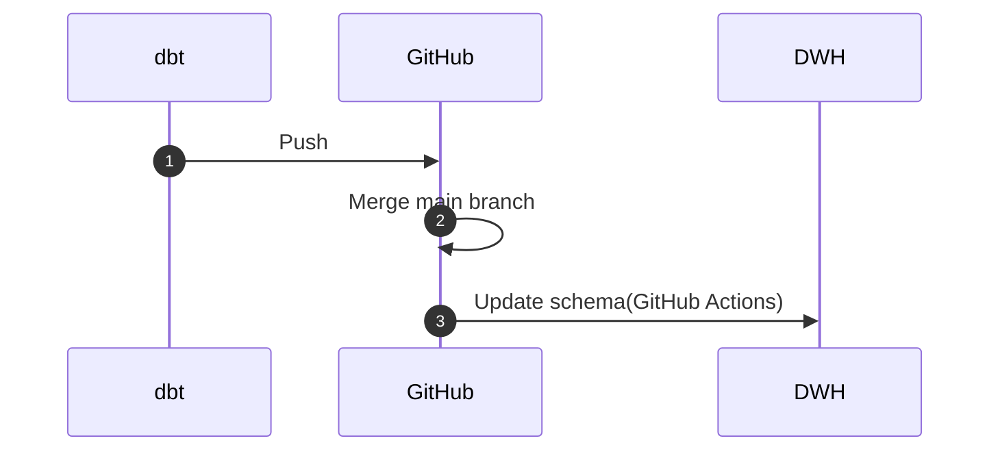

[dbt Advent Calendar 2023](https://qiita.com/advent-calendar/2023/dbt) の 4 日目の記事です。

「DWH に関するメタデータの管理を dbt だけで完結させたい…。」この願望は、データエンジニアやアナリティクスエンジニアであれば、一度は考えたことがあるのではないでしょうか。

私は、管理するサービスを余程の理由がない限り増やしたくない人間なので、メタデータに関しても全て dbt だけで完結させたいと思っています。

dbt で管理しているカラムのメタデータ（dbt Docs の description）を DWH にも反映させたいとき、`dbt_project.yml` などの設定ファイルに `persist_docs` プロパティを仕込むと、これを実現することができます。

```yml:dbt_project.yml
models:
  <resource-path>:
    +persist_docs:
      relation: true
      columns: true
```

しかし、この `persist_docs` プロパティは、記事公開時点の 2023 年 12 月 4 日では、残念ながら source の dbt Docs には対応していません。

︙

この記事では、dbt Docs の description を source に反映することをゴールとして、それを実現する手段の 1 つを紹介します。

## 概要

概要は、次の通りです。



ざっくり説明すると、GitHub Actions で Python を起動し、dbt の設定ファイル内の desription を DWH を更新するという流れになっています。

今回、description を反映する DWH を **BigQuery** として検証を行っていますが、この構成であれば Python の部分のみ修正すれば他の DWH でも問題なく動作するかと思います。

## 下準備

一緒に検証したい方は、このセクションを参考にして dbt の新しいプロジェクトを作成して動作確認してみてください。

雰囲気や流れだけを知りたいよという方は、次セクション以降を読み進めていただいても構いません。

### サンプルデータ

架空の従業員データを使用します。


検証用のデータなので分かり易さを重視しています。ID ではなく従業員名（ `emp_name` ）が主キーになっていることをご容赦ください。

### BigQuery

検証用の Google Cloud のプロジェクトを作成し、dbt で source として読み込む `raw_employee_salary` テーブルを作成します。

```sql
create or replace table staging.raw_employee_salary as
select *
from unnest (
    array<struct<
        emp_name string,
        boss_emp_name string,
        salary_amt int64
    >> [
        ('Albert', null, 1000),
        ('Bert', 'Albert', 900),
        ('Chuck', 'Albert', 900),
        ('Donna', 'Chuck', 800),
        ('Eddie', 'Chuck', 700),
        ('Fred', 'Chuck', 600)
    ]
)
```

今回の検証では、`staging` データセットの中に `raw_employee_salary` テーブルを格納しました。

### dbt Cloud

```plain: ディレクトリ構造(必要なものだけ表示)
root/
  ┣ models/
  ┃  ┣ mart/
  ┃  ┃ ┣ employee_salary.sql
  ┃  ┃ ┗ employee_salary.yml
  ┃  ┗ staging/
  ┃     ┗ raw_employee_salary.yml
  ┗ dbt_project.yml
```

```yml:dbt_project.yml
name: 'my_new_project'
version: '1.0.0'
config-version: 2

# 省略

models:
  my_new_project:
    +persist_docs:
      relation: true
      columns: true
    staging:
      +materialized: view
    mart:
      +materialized: table
```

#### Source

```yml:models/staging/raw_employee_salary.yml
version: 2

sources:
  - name: staging
    tables:
      - name: raw_employee_salary
        description: "従業員テーブル"
        columns:
          - name: emp_name
            description: "名前"

          - name: boss_emp_name
            description: "上司"

          - name: salary_amt
            description: "給与"
```

#### Model

```sql:models/mart/employee_salary.sql
with t1 as (
    select *
    from {{ source('staging', 'raw_employee_salary') }}
),

t2 as (
    select
        boss_emp_name,
        array_agg(emp_name) as subordinates,
    from t1
    where boss_emp_name is not null
    group by 1
)

select
    t1.*,
    t2.subordinates,
from t1
left join t2
    on t1.emp_name = t2.boss_emp_name
```

```yml:models/mart/employee_salary.yml
version: 2

models:
  - name: employee_salary
    description: "従業員テーブル"
    columns:
      - name: emp_name
        description: "名前"

      - name: boss_emp_name
        description: "上司"

      - name: salary_amt
        description: "給与"

      - name: subordinates
        description: "部下"
```

#### 動作確認

`dbt build` コマンドで、正常に動作するか確認します。


`raw_employee_salary` テーブルに description が反映されていないことを確認し、`employee_salary` テーブルが新たに作成され、description が反映されていることを確認してください。

## 実装

このセクションでは、source の dbt Docs からスキーマに関する情報を取得し、それを BigQuery のテーブルに反映する一連の流れを紹介しています。

### 1. GitHub Actions の環境構築

GitHub Actions は、`.github/workflows/` で実行ファイルを定義することができます。

```diff
  root/
+   ┣ .github/
+   ┃  ┗ workflows/
+   ┃     ┣ update_source_schemas.py
+   ┃     ┗ update_source_schemas.yml
    ┣ models/
    ┃  ┣ mart/
    ┃  ┃ ┣ employee_salary.sql
    ┃  ┃ ┗ employee_salary.yml
    ┃  ┗ staging/
    ┃     ┗ raw_employee_salary.yml
    ┗ dbt_project.yml
```

一旦、シンプルな構成の GitHub Actions で Python を実行できるか確認します。

```yml:.github/workflows/update_source_schemas.yml
name: update_source_schemas

on:
  push:
    branches:
      - main

jobs:
  update_source_schemas:
    runs-on: ubuntu-latest

    steps:
      - name: Checkout repository
        uses: actions/checkout@v3

      - name: Set up Python 3.11.3
        uses: actions/setup-python@v4
        with:
          python-version: '3.11.3'

      - name: Run script
        run: python .github/workflows/update_source_schemas.py
```

```python:.github/workflows/update_source_schemas.py
def main():
    print("\033[32m[SUCCESS]\033[0m GitHub Actions から実行されました。")


if __name__ == "__main__":
    main()
```

main ブランチにマージして動作確認します。


GitHub Actions から Python を実行することが出来ました。

### 2. source の情報を取得

`raw_employee_salary.yml` から情報を取得できるようにプログラムを修正します。

```diff python:.github/workflows/update_source_schemas.py
+ import yaml
+
+
  def main():
-     print("\033[32m[SUCCESS]\033[0m GitHub Actions から実行されました。")
+     # yamlファイルを開く
+     with open("models/staging/raw_employee_salary.yml", "r") as file:
+         data = yaml.safe_load(file)
+
+     # 読み込んだデータを表示
+     dataset = data["sources"][0]["name"]
+     table = data["sources"][0]["tables"][0]["name"]
+     columns = data["sources"][0]["tables"][0]["columns"]
+     print("dataset:", dataset)
+     print("table:", table)
+     print("columns:", columns)


  if __name__ == "__main__":
      main()
```

yaml ファイルから Python の `dict` に変換するために、外部モジュールの `pyyaml` を使用しているので、GitHub Actions に `pip` コマンドに関する記述を追加しています。

```diff yml:.github/workflows/update_source_schemas.yml
  name: update_source_schemas

  on:
    push:
      branches:
        - main

  jobs:
    update_source_schemas:
      runs-on: ubuntu-latest

      steps:
        - name: Checkout repository
          uses: actions/checkout@v3

        - name: Set up Python 3.11.3
          uses: actions/setup-python@v4
          with:
            python-version: '3.11.3'

+       - name: Install python modules
+         run: pip install pyyaml
+
        - name: Run script
          run: python .github/workflows/update_source_schemas.py
```

main ブランチにマージして動作確認します。


source の情報を取得することができました。

### 3. DWH に反映

source から取得した情報をもとに、BigQuery のテーブルを更新するようにプログラムを修正します。

BigQuery の Python クライアントでカラムの説明文を直接更新することができないので、`alter column set options` ステートメントを使用して強引に更新します。

```diff python:.github/workflows/update_source_schemas.py
+ from google.cloud import bigquery
  import yaml


  def main():
      # yamlファイルを開く
      with open("models/staging/raw_employee_salary.yml", "r") as file:
          data = yaml.safe_load(file)

      # 読み込んだデータを表示
      dataset = data["sources"][0]["name"]
      table = data["sources"][0]["tables"][0]["name"]
      columns = data["sources"][0]["tables"][0]["columns"]
      print("dataset:", dataset)
      print("table:", table)
      print("columns:", columns)

+     # スキーマを更新
+     client = bigquery.Client()
+     destination = f"{client.project}.{dataset}.{table}"
+     query_string = f"alter table `{destination}` " + ", ".join(
+         [
+             f"""alter column {col.get('name')} set options(description="{col.get('description')}")"""
+             for col in columns
+         ]
+     )
+     client.query(query_string)
+

  if __name__ == "__main__":
      main()
```

GitHub Actions から Google Cloud に接続するため、認証とセットアップに関する記述を追加しています。

```diff yml:.github/workflows/update_source_schemas.yml
  name: update_source_schemas

  on:
    push:
      branches:
        - main

  jobs:
    update_source_schemas:
      runs-on: ubuntu-latest

      steps:
        - name: Checkout repository
          uses: actions/checkout@v3

        - name: Set up Python 3.11.3
          uses: actions/setup-python@v4
          with:
            python-version: '3.11.3'

+       - name: Authenticate to Google Cloud
+         uses: google-github-actions/auth@v1
+         with:
+           credentials_json: ${{ secrets.GCP_SA_KEY }}
+
+       - name: Set up Google Cloud SDK
+         uses: google-github-actions/setup-gcloud@v1
+
        - name: Install python modules
-         run: pip install pyyaml
+         run: pip install pyyaml google-cloud-bigquery

        - name: Run script
          run: python .github/workflows/update_source_schemas.py
```

Google Cloud で GitHub Actions 用の サービスアカウントを作成し、GitHub の Repository Secrets に `GCP_SA_KEY` という名前で格納しています。

サービスアカウントには、BigQuery のテーブルスキーマを更新するため、「BigQuery データ編集者」と「BigQuery ジョブユーザー」のロールが必要です。


main ブランチにマージして動作確認します。


BigQuery のテーブルを更新することができました。

### 4. リファクタ

とりあえず動くコードが出来たので、関数化したり例外処理を加えたり、型ヒントを追加したりなどして、運用しやすいようにリファクタリングします。

```python:.github/workflows/update_source_schemas.py
from google.cloud import bigquery
from google.cloud.bigquery.client import Client
import yaml


def load_yaml(filepath: str) -> dict:
    with open(filepath, "r") as file:
        return yaml.safe_load(file)


def get_dataset_info(data: dict) -> tuple[str, str, list[dict[str, str]]]:
    dataset = data["sources"][0]["name"]
    table = data["sources"][0]["tables"][0]["name"]
    columns = data["sources"][0]["tables"][0]["columns"]
    return dataset, table, columns


def update_schema(client: Client, dataset: str, table: str, columns: list[dict[str, str]]) -> None:
    destination = f"{client.project}.{dataset}.{table}"
    query_string = f"alter table `{destination}` " + ", ".join(
        [
            f"""alter column {col.get('name')} set options(description="{col.get('description')}")"""
            for col in columns
        ]
    )
    client.query(query_string)


def main() -> None:
    try:
        data = load_yaml("models/staging/raw_employee_salary.yml")
        dataset, table, columns = get_dataset_info(data)
        client = bigquery.Client()
        update_schema(client, dataset, table, columns)
        print("\033[32m[SUCCESS]\033[0m 全ての処理が終了しました。")
    except Exception as e:
        print(f"\033[31m[ERROR]\033[0m {e}")


if __name__ == "__main__":
    main()
```

## チューニング

前のセクションで、一通り dbt Docs の description が source テーブルにも反映されることを確認しました。

ですが、このままだと汎用性が乏しいので、いろんな環境で使えるような改善案を紹介します。

### 1. 指定したディレクトリが更新された場合のみワークフローを実行する

現状のコードだと、あらゆる変更がトリガーになってしまい、GitHub Actions の無料枠を圧迫しています。

なので、staging ディレクトリが更新された場合のみ、ワークフローを実行するように変更します。

```diff yml:.github/workflows/update_source_schemas.yml
  name: update_source_schemas

  on:
    push:
      branches:
        - main
+     paths:
+       - 'models/staging/*.yml'

  jobs:
    update_source_schemas:
      runs-on: ubuntu-latest

      steps:
      # 省略
```

### 2. ファイルの指定を動的にする

現状のコードだと、`update_source_schemas.yml` というファイル名を直接指定しているので、ファイル数の増減やリネームに対応できるように修正します。

```diff python:.github/workflows/update_source_schemas.py
+ from glob import glob
+
  from google.cloud import bigquery
  from google.cloud.bigquery.client import Client
  import yaml

  # 省略

  def main() -> None:
      try:
-         data = load_yaml("models/staging/raw_employee_salary.yml")
-         dataset, table, columns = get_dataset_info(data)
          client = bigquery.Client()
-         update_schema(client, dataset, table, columns)
+         for filepath in glob("models/staging/*.yml"):
+             data = load_yaml(filepath)
+             dataset, table, columns = get_dataset_info(data)
+             update_schema(client, dataset, table, columns)
          print("\033[32m[SUCCESS]\033[0m 全ての処理が終了しました。")
      except Exception as e:
          print(f"\033[31m[ERROR]\033[0m {e}")


  if __name__ == "__main__":
      main()
```

### 3. source 以外の設定ファイルを読み込まないようにする

現状、model やその他の設定ファイルを読み込むとエラーになってしまうので、読み込まないように修正します。

```diff python:.github/workflows/update_source_schemas.py
  # 省略

  def main() -> None:
      try:
          client = bigquery.Client()
          for filepath in glob("models/staging/*.yml"):
              data = load_yaml(filepath)
+             if "sources" not in data.keys():
+                 continue
              dataset, table, columns = get_dataset_info(data)
              update_schema(client, dataset, table, columns)
          print("\033[32m[SUCCESS]\033[0m 全ての処理が終了しました。")
      except Exception as e:
          print(f"\033[31m[ERROR]\033[0m {e}")


  if __name__ == "__main__":
      main()
```

## さいごに

source の dbt Docs を DWH に反映するために、GitHub Actions を使用して実現する方法を紹介しました。

今回紹介した 3 つのチューニングの方法以外にも、環境によっては以下のようなチューニングを行う必要があるので、ご自身の環境に合わせて適宜修正してみてください。

- doc 関数の反映
- source の設定ファイルに複数のテーブルを記述しているときの対応
- git diff で更新があったファイルだけ更新

など

良き、メタデータ管理ライフを！最後まで閲覧ありがとうございました。
