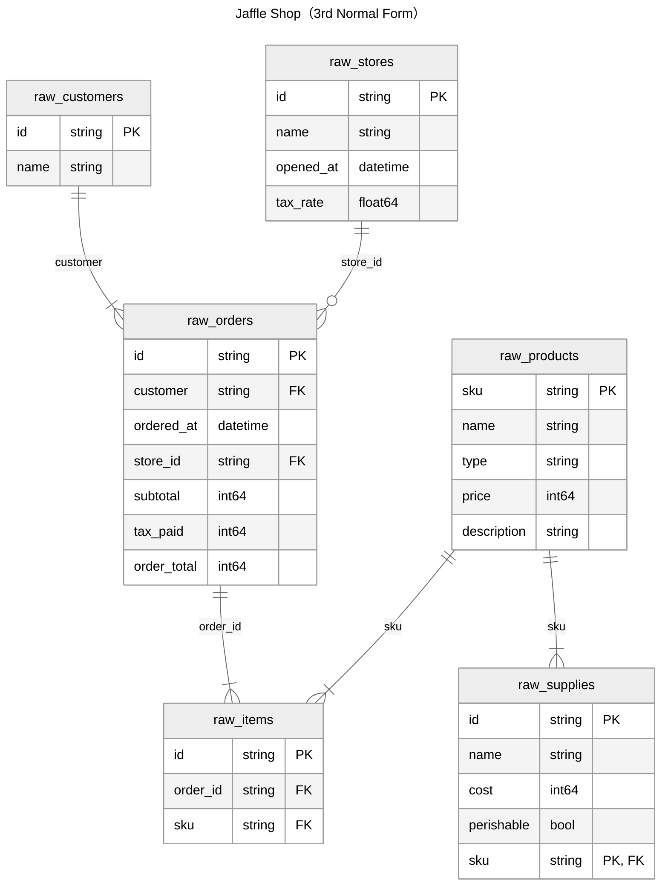
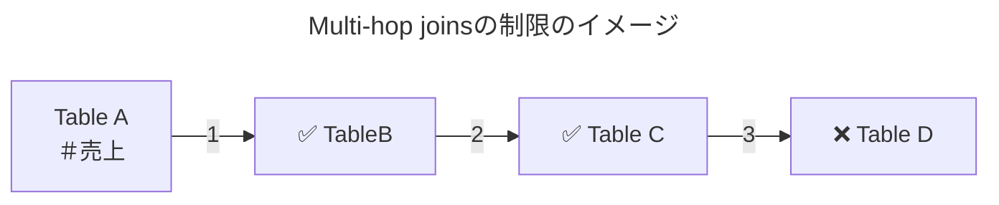
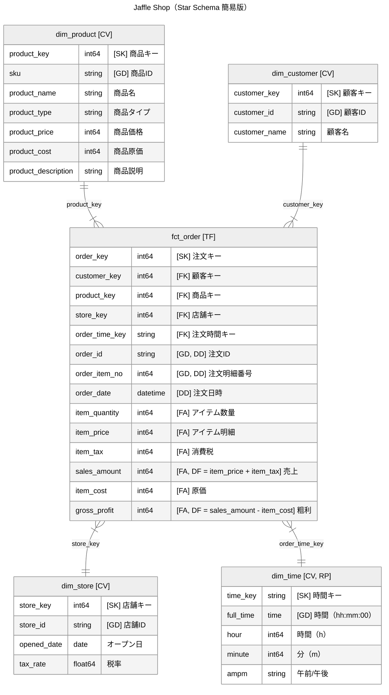

[dbt Advent Calendar 2025](https://qiita.com/advent-calendar/2025/dbt) の 5 日目の記事です。

**dbt Semantic Layer と Steep の組み合わせは、ビジネスメトリクスの一元管理とビジネスユーザーへの直感的なデータアクセスを両立できる強力な構成です**。利用し始めてから 1 年ちょっと経過したので、その間に学んだ実践的なノウハウをまとめてみました。

:::message
**この記事で学べること**

- dbt Semantic Layer と Steep の基本概念
- dbt Semantic Layer と Steep との連携時のポイント
- dbt Semantic Layer で制限されている Steep の機能

:::

:::message
**この記事の対象読者**

- dbt Semantic Layer の実践的な活用方法を知りたいデータエンジニア・アナリティクスエンジニア
- メトリクス定義の一元管理やセルフサービス BI の実現を目指している組織・チーム
- Steep の導入を検討しており、dbt Semantic Layer との連携方法や制限事項を事前に把握したい方

:::

この記事がきっかけで、dbt Semantic Layer と Steep の組み合わせを試してみたい方が増えると嬉しいです。

## はじめに

### dbt Semantic Layer とは

dbt Semantic Layer は、セマンティックレイヤーの実装で、MetricFlow を中核とする複数のコンポーネント（Semantic Models、Metrics）で構成されています。

多くの BI ツールは、それぞれが独自のセマンティックレイヤーを持っており、メトリクス定義がツールごとに分散していました。dbt Semantic Layer は BI ツールより上流に位置するため、メトリクス定義を一元管理し、複数の BI ツール（Tableau、Power BI、Steep など）から同じ定義のメトリクスを参照できるようになります。

https://docs.getdbt.com/docs/cloud-integrations/avail-sl-integrations

また、Multi-hop joins の制限（※後述しています）により、ファントラップやキャズムトラップを構造的に防止し、安全なメトリクスの集計が保証されています。

:::message alert
dbt Semantic Layer は、dbt Platform の Starter プラン以上で利用できます。
:::

### Steep とは

あとで書く

### dbt Semantic Layer と Steep の組み合わせることの何が嬉しいのか

あとで書く

### 本記事で使用するデータセット

dbt の利用者がイメージしやすいように、dbt Labs 社が提供している架空の E コマース注文データ「[Jaffle Shop](https://github.com/dbt-labs/jaffle-shop/tree/main/seeds/jaffle-data)」を使用します。

Jaffle Shop は、ジャッフル（オーストラリア発祥のホットサンドの一種）とドリンクを展開する架空のチェーン店のデータセットです。顧客の注文情報、商品マスタ、店舗情報、原価情報などが含まれており、典型的な注文プロセスのユースケースを学ぶのに適しています。



## 事前準備

dbt Semantic Layer と Steep を連携させるには、データモデルの設計とセマンティックレイヤー（セマンティックモデル、メトリクス）の定義の 2 つのステップが必要です。このセクションでは、Jaffle Shop データを例に、具体的な実装方法を説明します。

### データモデルの設計（スタースキーマへの変換）

dbt Semantic Layer を使用するためには、分析対象のデータ構造をスタースキーマまたは OBT に変換する必要があります。

これは、dbt Semantic Layer の仕様上、メトリクスが定義されているセマンティックモデルから見て 3 つ以上離れているテーブルを結合することができないためです。



> MetricFlow can join up to three tables, supporting multi-hop joins with a limit of **two hops**.

https://docs.getdbt.com/docs/build/join-logic#multi-hop-joins

:::message
この制限により、ファントラップやキャズムトラップが発生しないため、安全に集計を行うことができます。
:::

:::message
ディメンショナルモデリングの多値属性や多値ディメンションを取り扱うブリッジテーブルは、必然的に 3 ホップ以上の結合を必要とするため、dbt Semantic Layer で使用出来ません。

このような多対多の関係を扱う場合、以下のような回避策を検討する必要があります。

1. **新しくファクトテーブルを作る**: ブリッジテーブルの粒度でファクトテーブルを設計し直す
2. **配列風文字列を使う**: 複数の値を区切り文字で結合（e.g. `タグA|タグB|タグC`）し、1 つのディメンショナル属性として扱う
3. **代表値を選択する**: ビジネスルールに基づいて 1 つの値のみを保持する（e.g. メインカテゴリのみ）

配列風文字列を使う場合、Steep での検索性やフィルタリングの使い勝手が低下する点に注意が必要です。
:::



:::message
**スタースキーマについて**

本記事では、セマンティックレイヤーの理解を促進するため、ディメンショナルモデリングの行動属性やアウトリガー、SCD Type 2、ステップディメンション、ジャンクディメンション等のテクニックは使用していません。

まずは基本的なスタースキーマでセマンティックレイヤーの概念を理解することを優先しています。
:::

:::message
**カレンダーディメンションについて**

dbt Semantic Layer は `agg_time_dimension` に対して、時間・日・週・月・四半期・年といった標準的な時間粒度での集計を自動的にサポートします。そのため、以下のような一般的な時系列分析であれば、カレンダーディメンションテーブルを作成せずに実現できます。

- 月別推移
- 四半期比較
- 年次成長率

ただし、以下のような要件がある場合は、カレンダーディメンションテーブルの作成を検討してください。

- **会計年度**: 4 月始まりなど、暦年と異なる年度での集計
- **祝日/休日**: 営業日ベースでの分析
- **曜日/週次パターン**: 「月曜日の売上」など曜日別の比較
- **カスタム期間**: キャンペーン期間、商戦期などの独自期間定義

:::

:::message
**時間ディメンションについて**

dbt Semantic Layer 自体は `agg_time_dimension` で hour（時間）粒度をサポートしていますが、現時点の Steep では hour 粒度での集計がサポートされていません。

時間単位での分析が必要な場合は、`dim_time` のような時間ディメンションテーブルを作成し、`hour`（時）や `minute`（分）、`ampm`（午前/午後）といった属性を定義します。これにより、「午前中の注文件数」や「ピークタイムの売上」といった時間帯別の分析が可能になります。
:::

### セマンティックモデルの定義

セマンティックモデルは、dbt Semantic Layer においてメトリクスを定義する基盤となるオブジェクトです。ここでは、スタースキーマに変換した 5 つのテーブル（`fct_order`、`dim_customer`、`dim_product`、`dim_store`、`dim_time`）に対応するセマンティックモデルを定義します。

セマンティックモデルは、以下の要素で構成されます。

- **entities**: テーブル間の結合キー（`primary` または `foreign`）
- **dimensions**: 分析軸となるディメンショナル属性（`categorical` または `time`）
- **measures**: 集計対象となるファクト（ファクトテーブルのみ）

#### dim_customer（2 つのディメンショナル属性を持つ）:

```yaml
semantic_models:
  - name: customer_dimension
    model: ref('dim_customer')
    description: "顧客ディメンションテーブル"

    entities:
      - name: customer
        type: primary
        expr: customer_key

    dimensions:
      - name: customer_id
        type: categorical
        expr: customer_id
        label: "顧客ID"
        description: "ここには「顧客ID」の説明文が入ります。"

      - name: customer_name
        type: categorical
        expr: customer_name
        label: "顧客名"
        description: "ここには「顧客名」の説明文が入ります。"
```

#### dim_product（8 つのディメンショナル属性を持つ）:

```yaml
semantic_models:
  - name: product_dimension
    model: ref('dim_product')
    description: "商品ディメンションテーブル"

    entities:
      - name: product
        type: primary
        expr: product_key

    dimensions:
      - name: sku
        type: categorical
        expr: sku
        label: "SKU"
        description: "ここには「SKU」の説明文が入ります。"

      - name: product_name
        type: categorical
        expr: product_name
        label: "商品名"
        description: "ここには「商品名」の説明文が入ります。"

      - name: product_type
        type: categorical
        expr: product_type
        label: "商品種別（jaffle|beverage）"
        description: "ここには「商品種別」の説明文が入ります。"

      - name: product_price
        type: categorical
        expr: product_price
        label: "商品単価"
        description: "ここには「商品単価」の説明文が入ります。"

      - name: product_cost
        type: categorical
        expr: product_cost
        label: "商品原価"
        description: "ここには「商品原価」の説明文が入ります。"

      - name: cost_rate
        type: categorical
        expr: cost_rate
        label: "原価率"
        description: "ここには「原価率」の説明文が入ります。"

      - name: profitability_level
        type: categorical
        expr: profitability_level
        label: "収益レベル（高|中|低）"
        description: "ここには「収益レベル」の説明文が入ります。"

      - name: product_description
        type: categorical
        expr: product_description
        label: "商品詳細"
        description: "ここには「商品詳細」の説明文が入ります。"
```

#### dim_store（4 つのディメンショナル属性を持つ）:

```yaml
semantic_models:
  - name: store_dimension
    model: ref('dim_store')
    description: "店舗ディメンションテーブル"

    entities:
      - name: store
        type: primary
        expr: store_key

    dimensions:
      - name: store_id
        type: categorical
        expr: store_id
        label: "店舗ID"
        description: "ここには「店舗ID」の説明文が入ります。"

      - name: store_name
        type: categorical
        expr: store_name
        label: "店舗名"
        description: "ここには「店舗名」の説明文が入ります。"

      - name: opened_date
        type: time
        type_params:
          time_granularity: day
        expr: opened_date
        label: "オープン日"
        description: "ここには「オープン日」の説明文が入ります。"

      - name: tax_rate
        type: categorical
        expr: tax_rate
        label: "税率"
        description: "ここには「税率」の説明文が入ります。"
```

#### dim_time（4 つのディメンショナル属性を持つ）:

```yaml
semantic_models:
  - name: order_time_dimension
    model: ref('dim_time')
    description: "注文時間ディメンションテーブル"

    entities:
      - name: order_time
        type: primary
        expr: time_key

    dimensions:
      - name: order_hour
        type: categorical
        expr: hour
        label: "注文時間（h）"
        description: "ここには「注文時間（h）」の説明文が入ります。"

      - name: order_minute
        type: categorical
        expr: minute
        label: "注文分（m）"
        description: "ここには「注文分（m）」の説明文が入ります。"

      - name: ampm
        type: categorical
        expr: ampm
        label: "午前午後"
        description: "ここには「午前午後」の説明文が入ります。"
```

#### fct_order（2 つのディメンショナル属性、8 個の加法性ファクト属性を持つ）:

```yaml
semantic_models:
  - name: order_fact
    model: ref('fct_order')
    description: "注文トランザクション・ファクトテーブル"
    defaults:
      agg_time_dimension: order_date

    entities:
      - name: order
        type: primary
        expr: order_key

      - name: product
        type: foreign
        expr: product_key

      - name: customer
        type: foreign
        expr: customer_key

      - name: store
        type: foreign
        expr: store_key

      - name: order_time
        type: foreign
        expr: order_time_key

    dimensions:
      - name: order_id
        type: categorical
        expr: order_id
        label: "注文ID"
        description: "ここには「注文ID」の説明文が入ります。"

      - name: order_item_no
        type: categorical
        expr: order_item_no
        label: "注文明細番号"
        description: "ここには「注文明細番号」の説明文が入ります。"

      - name: order_date
        type: time
        expr: order_date
        type_params:
          time_granularity: day
        label: "注文日時"
        description: "ここには「注文日時」の説明文が入ります。"

    measures:
      - name: order_fact_measure_record_count
        agg: count_distinct
        expr: 1

      - name: order_fact_measure_order_count
        agg: count_distinct
        expr: order_id

      - name: order_fact_measure_item_quantity
        agg: sum
        expr: item_quantity

      - name: order_fact_measure_item_price
        agg: sum
        expr: item_price

      - name: order_fact_measure_item_tax
        agg: sum
        expr: item_tax

      - name: order_fact_measure_sales_amount
        agg: sum
        expr: sales_amount

      - name: order_fact_measure_item_cost
        agg: sum
        expr: item_cost

      - name: order_fact_measure_gross_profit
        agg: sum
        expr: gross_profit
```

:::message
**measures の `name` プロパティについて**

measures の `name` プロパティは、全てのセマンティックモデルで一意でなければなりません。

実際の運用では、名前が被らないように、`<semantic_model_name>_measure_<metrics_name>` の形式で命名しています。
:::

### メトリクスの定義

メトリクスは、セマンティックモデルで定義した measures を基に作成します。Steep 上でビジネスユーザーが実際に選択・集計するのはこのメトリクスです。ここでは `fct_order` に対して 8 つのメトリクスを定義します。

#### fct_order（8 個のメトリクスを持つ）:

```yaml
metrics:
  - name: order_fact_metrics_record_count
    label: "注文レコードカウント"
    description: "ここには「注文レコードカウント」の説明文が入ります。"
    type: simple
    type_params:
      measure: order_fact_measure_record_count

  - name: order_fact_metrics_order_count
    label: "注文件数"
    description: "ここには「注文件数」の説明文が入ります。"
    type: simple
    type_params:
      measure: order_fact_measure_order_count

  - name: order_fact_metrics_item_quantity
    label: "注文数量合計"
    description: "ここには「注文数量合計」の説明文が入ります。"
    type: simple
    type_params:
      measure: order_fact_measure_item_quantity

  - name: order_fact_metrics_item_price
    label: "注文明細合計"
    description: "ここには「注文明細合計」の説明文が入ります。"
    type: simple
    type_params:
      measure: order_fact_measure_item_price

  - name: order_fact_metrics_item_tax
    label: "注文消費税合計"
    description: "ここには「注文消費税合計」の説明文が入ります。"
    type: simple
    type_params:
      measure: order_fact_measure_item_tax

  - name: order_fact_metrics_sales_amount
    label: "注文売上合計"
    description: "ここには「注文売上合計」の説明文が入ります。"
    type: simple
    type_params:
      measure: order_fact_measure_sales_amount

  - name: order_fact_metrics_item_cost
    label: "注文原価合計"
    description: "ここには「注文原価合計」の説明文が入ります。"
    type: simple
    type_params:
      measure: order_fact_measure_item_cost

  - name: order_fact_metrics_gross_profit
    label: "注文粗利合計"
    description: "ここには「注文粗利合計」の説明文が入ります。"
    type: simple
    type_params:
      measure: order_fact_measure_gross_profit
```

:::message
**metrics の `name` プロパティについて**

metrics の `name` プロパティは、全てのメトリクスで一意でなければなりません。

実際の運用では、名前が被らないように、`<semantic_model_name>_metrics_<metrics_name>` の形式で命名しています。
:::

## Steep との接続設定

セマンティックモデルとメトリクスの定義が完了したら、Steep と dbt Semantic Layer を接続します。このセクションでは、初回接続の手順、定義変更時の同期方法、そしてクエリ結果のキャッシュ設定について説明します。

### 初回接続の手順

dbt Semantic Layer と Steep を接続する方法は、Steep の公式ドキュメントにスクショ付きで詳しく紹介されているため、そちらを参照してください。

https://help.steep.app/integrations/dbt-cloud#connecting-the-dbt-semantic-layer-to-steep

接続に成功すると、dbt Semantic Layer で定義されているセマンティックモデルとメトリクスが Steep に同期されます。


### セマンティックレイヤーの同期方法

初回接続以降で、dbt 側でセマンティックモデルやメトリクスの定義を変更した場合、**必ず Steep 側で再同期が必要**です。同期する方法は 2 種類あります。

1. API Sync - API による自動同期、本番環境での自動同期に最適
2. Manual Sync - UI からの手動同期、開発環境での動作確認に最適

#### API Sync - API による自動同期

API Sync では、API エンドポイントを使用してセマンティックレイヤーを更新することができます。

```bash
curl 'https://api.steep.app/semantic-layer-syncs' \
  -H 'Content-Type: application/json' \
  -H 'Authorization: ApiKey <API_KEY>' \
  -X POST -d '{ "datasource_id": "<DATASOURCE_ID>" }'
```

:::message
API Key とデータソース ID は、Steep の `Settings > Integrations` で確認できます。


:::

API Sync は、dbt の Webhooks 機能と連携させることで自動同期することができます。

https://docs.getdbt.com/docs/deploy/webhooks

具体的には、dbt Cloud からの Webhook を受け取るサーバーやサービスを用意し、そこからこの API エンドポイントへ HTTP リクエストを実行します。これにより、**dbt Platform の本番ジョブの成功と同時に Steep 側の定義も最新化されます**。

#### Manual Sync - UI からの手動同期

Manual Sync では、Steep の UI 上から手動で同期ボタン（`Sync now`）をクリックしてセマンティックレイヤーを更新することができます。


開発環境での動作確認や、小規模な変更時に便利ですが、本番環境では API Sync + dbt Webhooks による自動化を推奨します。

### データ（クエリ結果）の更新

セマンティックレイヤーの同期は「セマンティックモデルとメトリクスの定義」の更新ですが、実際のデータ（クエリ結果）は別途キャッシュ機構で管理されます。

Steep で実行したクエリ結果は Steep 側でキャッシュされます。キャッシュの有効期限はワークスペース設定で指定でき、以下から選択可能です。

- 1 時間
- 2 時間
- 4 時間（デフォルト）
- 8 時間

設定した期限を過ぎると、次回クエリ実行時に自動的に dbt Semantic Layer から最新データが取得されます。

https://help.steep.app/using-steep/query-cache

## 連携ガイド

このセクションでは、dbt Semantic Layer と Steep の連携における以下の 3 つのポイントを説明します。

1. dbt Semantic Layer で定義したプロパティが Steep の UI 上でどのように表示されるか
2. Steep 独自の拡張プロパティによるメトリクスの分類・管理方法
3. 非加法性メトリクスを適切に表示するための実装パターン

### プロパティと UI の対応関係

#### セマンティックモデルの表示

| dbt Semantic Layer       | Steep                                        |
| ------------------------ | -------------------------------------------- |
| `entities.name`          | ディメンショナル属性のグループ名             |
| `dimensions.label`       | ディメンショナル属性の表示名                 |
| `dimensions.description` | ディメンショナル属性の説明文（ツールチップ） |

```yaml
entities:
  - name: store
    type: primary
    expr: store_key

dimensions:
  - name: store_id
    type: categorical
    expr: store_id
    label: "店舗ID"
    description: "ここには「店舗ID」の説明文が入ります。"
```


#### メトリクスの表示

| dbt Semantic Layer | Steep              |
| ------------------ | ------------------ |
| `label`            | メトリクスの表示名 |
| `description`      | メトリクスの説明文 |

```yaml
metrics:
  - name: order_fact_metrics_order_count
    label: "注文件数"
    description: "ここには「注文件数」の説明文が入ります。"
    type: simple
    type_params:
      measure: order_fact_measure_order_count
```


### Steep の拡張プロパティ

`config.meta` 配下に Steep の拡張プロパティを設定することで、メトリクスの分類や公開範囲を制御できます。

```yaml
metrics:
  - name: order_fact_metrics_order_count
    label: "注文件数"
    description: "ここには「注文件数」の説明文が入ります。"
    type: simple
    type_params:
      measure: order_fact_measure_order_count
    config:
      meta:
        category_name: "注文"
        owner_emails: ["tanu@example.com"]
        is_private: false
        unlisted: false
```

| プロパティ名    | 機能                                                   | 補足説明                                                                                                                         |
| --------------- | ------------------------------------------------------ | -------------------------------------------------------------------------------------------------------------------------------- |
| `category_name` | メトリクスが所属するカテゴリ名                         | メトリクスを用途ごとにグルーピングできる機能です                                                                                 |
| `owners_emails` | メトリクスオーナーのメールアドレス                     | Steep に登録しているユーザーのメールアドレスを配列で指定します                                                                   |
| `is_private`    | メトリクスを非公開にするかどうか、デフォルトは `false` | 機密性の高いメトリクスなど、アクセスを制限したいメトリクスに使用します                                                           |
| `unlisted`      | メトリクスを非表示にするかどうか、デフォルトは `false` | 派生メトリクスの計算に使用する中間メトリクスなど、エンドユーザーには見せたくないが削除はできないメトリクスを非表示にする機能です |

:::message
これらのプロパティには、接頭辞 `steep_` を付けることができます（e.g. `steep_category_name`）。これにより、他のアプリケーションやツールとの競合を避けることができます。
:::


https://help.steep.app/integrations/dbt-cloud#3.-set-metadata

### 非加法性メトリクスの実装パターン

利益率や構成比、客単価などの非加法性メトリクスを実装する際、メトリクスタイプの選択によって Steep の UI 上での表示形式が異なります。パーセント表記が必要な場合は [Ratio metrics](https://docs.getdbt.com/docs/build/ratio)、通貨や数値表記の場合は [Derived metrics](https://docs.getdbt.com/docs/build/derived) を使い分けます。

:::message
**メトリクスタイプの使い分け:**

- **Ratio metrics**: 利益率、構成比、転換率など、パーセント表記が適切なメトリクス
- **Derived metrics**: CPA（顧客獲得単価）、客単価など、通貨や数値表記が適切なメトリクス

:::

#### Derived metrics の場合

```yaml
metrics:
  - name: order_fact_metrics_gross_profit_rate
    label: "注文粗利率"
    description: "ここには「注文粗利率」の説明文が入ります。"
    type: derived
    type_params:
      expr: coalesce(safe_divide(order_fact_metrics_gross_profit, order_fact_metrics_sales_amount), 0)
      metrics:
        - name: order_fact_metrics_gross_profit
        - name: order_fact_metrics_sales_amount
```


:::message
**Steep での表示:**

- 小数表記（例: `0.8`）で表示される
- 注文粗利率は、パーセント表記で出力すべきメトリクスなので、Ratio metrics を使用すべきである

:::

#### Ratio metrics の場合

```yaml
metrics:
  - name: order_fact_metrics_gross_profit_rate
    label: "注文粗利率"
    description: "ここには「注文粗利率」の説明文が入ります。"
    type: ratio
    type_params:
      numerator:
        name: order_fact_metrics_gross_profit
      denominator:
        name: order_fact_metrics_sales_amount
```


:::message
**Steep での表示:**

- 自動的にパーセント表記（例: `80%`）で表示される
- 注文粗利率は、パーセント表記で出力すべきメトリクスなので、Ratio metrics を使用した方が適切である

:::

## 制限事項

dbt Semantic Layer と Steep を連携して使用する場合、Steep が独自に提供している一部の機能が制限されます。これは、サードパーティ製のセマンティックレイヤー（dbt Semantic Layer や Cube など）を使用する場合の共通の制約です。

### Steep のネイティブセマンティックレイヤーでのみ利用可能な機能

以下の機能は、Steep のネイティブセマンティックレイヤーを使用している場合にのみ利用できます。

- [Cohorts analysis](https://help.steep.app/using-steep/cohorts): コホート分析（共通の特性を持つユーザーグループの行動を時系列で追跡・分析できる機能）
- [Maps](https://help.steep.app/using-steep/maps): 地理データの可視化（H3 セルインデックス形式の地理データを持つメトリクスを地図上で可視化できる機能）
- [Entities](https://help.steep.app/using-steep/entities): エンティティのドリルダウン（メトリクスの集計値から行レベルのデータにドリルダウンできる機能）

:::message
これらの機能が必要な場合は、以下のようなハイブリッド運用も可能です。

- **基本的なメトリクス**: dbt Semantic Layer で定義
- **コホート分析・地図可視化用のメトリクス**: Steep のセマンティックレイヤーで定義

ただし、メトリクス定義が複数の場所に分散するため、ガバナンスの観点から慎重に検討する必要があります。
:::

## さいごに

本記事では、dbt Semantic Layer と Steep を連携させる際の実践的なノウハウを、Jaffle Shop のデータセットを例に紹介しました。

**dbt Semantic Layer でメトリクスを一元管理し、Steep でビジネスユーザーが直感的にデータを探索できる環境を構築することで、真の意味で組織全体にデータドリブンな意思決定を促進できると確信しています。**

:::message
BI ツールに閉じたセマンティックレイヤーではなく、あらゆるアプリケーションやツールからアクセスできるユニバーサルなセマンティックレイヤーに、データと AI の利活用の未来を賭けたいと考えています 🔥
:::

熱量がもれてしまいましたが、dbt Semantic Layer ✕ Steep の組み合わせは、multi-hop joins の制限やコホート分析などの機能制約もあるため、自組織の要件と照らし合わせながら導入を検討することをおすすめします。

冒頭での繰り返しになりますが、この記事がきっかけで、dbt Semantic Layer と Steep の組み合わせを試してみたい方が増えると幸甚の極みです。

最後までお読みいただき、ありがとうございました。

https://x.com/tanuhack/status/1943657671460364447?s=20
