[dbt Advent Calendar 2024](https://qiita.com/advent-calendar/2024/dbt) の 5 日目の記事です。

:::message
**この記事で学べること**

- データカタログにおけるセマンティックレイヤー管理の重要性について
- dbt Semantic Layer で提供されるセマンティックモデルの基本的な概念
- dbt Cloud の Discovery API の具体的な活用方法

:::

## 背景

生成 AI の活用が広がり、RAG（Retrieval-Augmented Generation）の登場により、企業は独自の文書やデータベースの知識を生成 AI に活用できるようになりました。しかし、ビジネスでの本格活用に向けては、より深い文脈理解と高い応答精度が求められ、LLM や RAG の性能向上が重要な課題となっています。

そんな中、いま密かにデータ界隈で注目を集めているのが『**セマンティックレイヤー**』という技術です。データに意味やコンテキストを付与するこの技術は、組織固有の知識を生成 AI に効率的に学習させる鍵として期待されています。

dbt Labs は『**dbt Semantic Layer**』というセマンティックレイヤーを実現するためのサービスを提供しています。同社は先日開催された dbt coalesce 2024 において、**単なるデータ変換ツールではなく、データコントロール全体を担うプラットフォームを目指すビジョン**を掲げており、今後のアップデートでセマンティックレイヤー機能がさらに強化されることが期待されています。


_出所: [One dbt: the biggest features we announced at Coalesce 2024 | dbt Labs](https://www.getdbt.com/blog/coalesce-2024-product-announcements)_

しかし、セマンティックレイヤーを実現するための基盤整備には、まだいくつかの課題が残されています。特に注目すべきなのが、既存のモダンデータスタック系のサービスを組み合わせても**ビジネス的な意味や関連性を含めたメタデータの管理が困難であること**です。

既存のデータカタログツールの多くは、物理的なテーブルのメタデータを管理することに主眼を置いており、セマンティックモデルのような論理的なレイヤーを網羅的に扱えるものは、今のところ見つけることができませんでした。

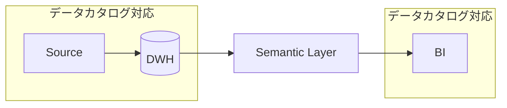

ところが幸いなことに dbt Cloud には Discovery API という機能があり、これを使えばセマンティックモデルを含む様々なメタデータを取得することができます。**特にセマンティックモデル間の関係性を理解することは、データの意味やコンテキストを把握する上で重要な要素となります**。

:::message
経験則にはなりますが、特に SQL に精通したビジネスユーザーほど、DWH とセマンティックレイヤーのデータ構造の違いに戸惑うことが多いです（もちろん説明すれば理解は早いのですが...）。

セマンティックモデルの全体像も可視化することで、データ利用者がデータの持つ意味やコンテキスト、相互の関連性をより直感的に理解できるようになり、データ利用体験の向上やコミュニケーションコストの削減が期待されます。
:::

そこで、当記事では dbt Cloud の Discovery API を活用して、セマンティックモデルの関係性を mermaid.js で可視化する方法を紹介します。これは本格的なデータカタログツールでの対応が整うまでの暫定的な解決策にはなりますが、セマンティックモデルの全体像を把握する助けになるはずです。

## セマンティックモデルの基本的な概念

セマンティックモデルに関する Discovery API の活用方法を説明する前に、まずはその基本的な概念について整理していきましょう。

:::message
dbt Semantic Layer の詳細については、[Tokyo dbt Meetup #9](https://www.meetup.com/ja-JP/tokyo-dbt-meetup/events/301497854/?eventorigin=group_events_list) で発表した「[dbt Semantic Layer ( MetricFlow ) の理解を深める](https://speakerdeck.com/tanuuuuuuu/dbt-semantic-layer-metricflow-noli-jie-woshen-meru)」という資料にまとめているので、当記事では詳細な説明は省略させていただきます。
:::

### 物理モデルから論理モデルへの変換

セマンティックモデルの本質は、物理的なデータ構造をビジネスの文脈に即した論理的なデータモデルへと変換することにあります。

この変換により、データエンジニアやアナリティクスエンジニアが構築した物理的なデータ構造を、ビジネスユーザーにとってより理解しやすい形に再構成することができます。

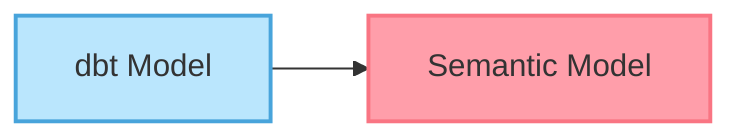

### 物理モデルと論理モデルの関係性

セマンティックモデルの重要な特徴として、物理的なデータモデルと論理的なセマンティックモデルとの間には、 1 対多の関係性が存在することが挙げられます。これは、1 つの物理モデルから複数の異なる視点や用途に応じたセマンティックモデルを作成できることを意味します。

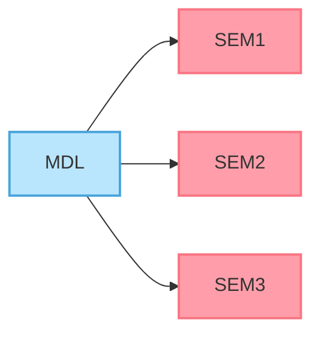

### マルチホップ結合の制約

また、dbt Semantic Layer では、テーブル間の結合（JOIN）に「2 ホップまで」という制約があります。

https://docs.getdbt.com/docs/build/join-logic#multi-hop-joins

これは例えば、注文（orders）から顧客（customers）、さらに国（countries）までの結合はできますが、そこからさらに地域（regions）までは結合できないということを意味します。

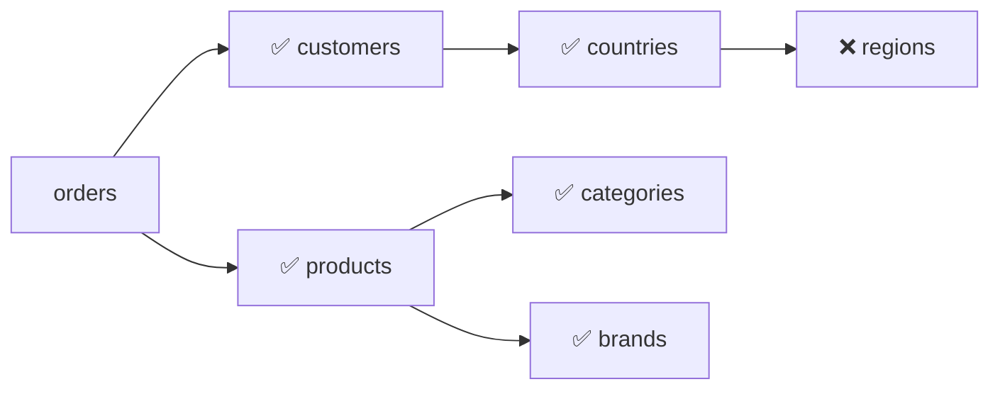

この制約もあり、実際のセマンティックモデルの構造は、ディメンショナルモデリングや OBT など、シンプルなデータモデリング手法に基づいて設計されることが一般的です。

## 1 対多の関係性を持つセマンティックモデルの例

実際のデータモデリングでよく見られるパターンの 1 つに「**ロールプレイングディメンション**」があります。これは、ディメンショナルモデリングにおいて 1 つのディメンションテーブルが複数の役割を担うパターンを指します。

### 物理モデルの構造

以下の例では、`dim_date` モデルは `fct_order` モデルに対して、注文日（`order_date`）と初回注文日（`first_order_date`）という 2 つの異なる役割を持っています。

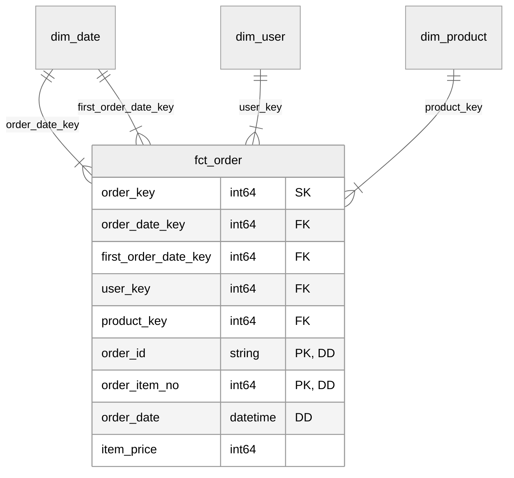

### 論理モデルへの変換

ロールプレイングディメンションは、セマンティックモデルに変換される際に、それぞれの役割に応じて個別のディメンションとして表現されます。

以下の図は、物理モデルから論理モデルへの変換の例を示しています。


この変換過程では、モデルの命名規則も変更していますが、これは単なる好みの問題ではなく、それぞれのコンテキストに最適化した命名方針です。

- **dbt Model（物理モデル）の命名規則:** 技術的な整理を重視した命名
  - プレフィックス（`fct_` / `dim_`）を先頭に配置
  - DWH 内でのファイル管理や検索の効率化を重視
- **Semantic Model（論理モデル）の命名規則:** ビジネス的な意味を重視した命名
  - サフィックス（`_fact` / `_dimension`）を末尾に配置
  - ビジネス上の概念を名前の先頭で強調

実際のプロジェクトでは、チームの合意のもと、一貫性のある命名規則を採用することが重要です。

### 変換後のモデル構造

セマンティックモデルでは、物理モデルの `dim_date` が `order_date_dimension` と `first_order_date_dimension` という 2 つの論理モデルに分割されています。

このように役割ごとにモデルを分けることで、各日付の持つ意味がより明確になり、BI ツールでのレポートラベルや分析時の混乱を防ぐことができます。

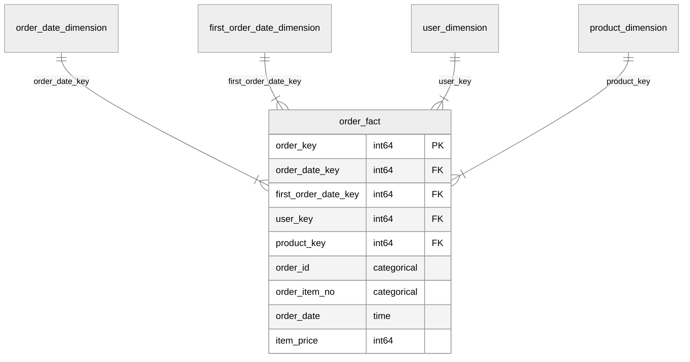

### 【おまけ】ロールプレイングディメンションの設定例

:::details dbt Semantic Layer

```yaml:dim_date.yml
semantic_models:
  - name: order_date_dimension
    model: ref('dim_date')
    description: "注文日付ディメンションテーブル"

    entities:
      - name: order_date_key
        type: primary
        expr: date_key

    dimensions:
      - name: order_year_and_month
        type: categorical
        expr: year_and_month
        label: "[📅 order_date] 注文年月（yyyymm）"
        description: ""

      - name: order_year
        type: categorical
        expr: year
        label: "[📅 order_date] 注文年（yyyy）"
        description: ""

      - name: order_month
        type: categorical
        expr: month
        label: "[📅 order_date] 注文月（m）"
        description: ""

      - name: order_day
        type: categorical
        expr: day
        label: "[📅 order_date] 注文日（d）"
        description: ""

      - name: order_day_of_week
        type: categorical
        expr: |
          case
            when day_of_week = '月' then '1. 月'
            when day_of_week = '火' then '2. 火'
            when day_of_week = '水' then '3. 水'
            when day_of_week = '木' then '4. 木'
            when day_of_week = '金' then '5. 金'
            when day_of_week = '土' then '6. 土'
            when day_of_week = '日' then '7. 日'
            else day_of_week
          end
        label: "[📅 order_date] 注文曜日"
        description: ""

      - name: is_holiday
        type: categorical
        expr: is_holiday
        label: "[📅 order_date] 休日フラグ"
        description: ""

      - name: is_public_holiday
        type: categorical
        expr: is_public_holiday
        label: "[📅 order_date] 祝日フラグ"
        description: ""

  - name: first_order_date_dimension
    model: ref('dim_date')
    description: "初回注文日付ディメンションテーブル"

    entities:
      - name: first_order_date_key
        type: primary
        expr: date_key

    dimensions:
      - name: first_order_date
        type: time
        expr: full_date
        type_params:
          time_granularity: day
        label: "[📅 first_order_date] 初回注文日"
        description: ""

      - name: first_order_year_and_month
        type: categorical
        expr: year_and_month
        label: "[📅 first_order_date] 初回注文年月（yyyymm）"
        description: ""

      - name: first_order_year
        type: categorical
        expr: year
        label: "[📅 first_order_date] 初回注文年（yyyy）"
        description: ""
```

:::

:::details Steep（BI ツール）でのロールプレイングディメンションの見え方

:::

## Discovery API の概要

dbt Cloud の Discovery API は、プロジェクト内のメタデータにアクセスするための GraphQL エンドポイントです。セマンティックモデルや dbt モデル、実行結果など、プロジェクトに関する様々な情報から必要なものだけを柔軟に取得できます。

:::message alert
Discovery API は dbt Cloud のチームまたはエンタープライズプランでのみ利用可能です。
:::

この API を活用することで、以下のようなデータ基盤の運用改善が可能になります:

- データモニタリングとアラート
- データリネージの探索
- 自動レポーティング
- データ品質の管理
- パイプライン運用の改善


_出所: [About the Discovery API | dbt Labs](https://docs.getdbt.com/docs/dbt-cloud-apis/discovery-api)_

### Discovery API を使用する手順

以下の手順で Discovery API を使用することができます:

1. サービストークンの発行
2. GraphQL クエリの作成

https://docs.getdbt.com/docs/dbt-cloud-apis/discovery-querying

#### 1. サービストークンの発行

Discovery API 用のサービストークンは、dbt Cloud の `Account Settings` > `Settings` > `API tokens` > `Service tokens` から発行できます。


_Service tokens_

発行時には以下の点に注意してください:

- アクセスを許可するプロジェクトを選択する
- 権限は `Metadata Only` を指定する
- 発行したトークンは一度しか表示されないため、安全な場所に保管する

#### 2. GraphQL クエリの作成

クエリの作成には、dbt Cloud が提供する [GraphQL explorer](https://metadata.cloud.getdbt.com/graphql) を使用すると便利です。このサンドボックス環境で、実際のクエリをテストしながら作成できます。


_GraphQL explorer_

以下は、プロジェクト内のセマンティックモデルのメタデータを取得するクエリの例です。

```graphql
query Dimensions($environmentId: BigInt!, $first: Int) {
  environment(id: $environmentId) {
    definition {
      semanticModels(first: $first) {
        edges {
          node {
            name
            dimensions {
              name
              type
            }
            measures {
              name
              expr
            }
            entities {
              name
              type
            }
          }
        }
      }
    }
  }
}
```

### Python で Discovery API を使用する

実運用時には様々な設定が必要になりますが、以下は Discovery API を Python で使用するための最小限のコードです。認証とクエリの基本的な実行方法を示しています。

```python:main.py
import requests

DBT_ENVIRONMENT_ID = "{{ YOUR_ENVIRONMENT_ID }}"
DBT_DISCOVERY_API_KEY = "{{ YOUR_DISCOVERY_API_KEY }}"
DBT_DISCOVERY_API_ENDPOINT = "{{ YOUR_DISCOVERY_API_ENDPOINT }}"

def main() -> None:
    # セマンティックモデルのメタデータを取得するクエリ
    query_string = """
    query Dimensions($environmentId: BigInt!, $first: Int) {
      environment(id: $environmentId) {
        definition {
          semanticModels(first: $first) {
            edges {
              node {
                name
                dimensions {
                  name
                  type
                }
                measures {
                  name
                  expr
                }
                entities {
                  name
                  type
                }
              }
            }
          }
        }
      }
    }
    """
    query_variables = {
        "environmentId": DBT_ENVIRONMENT_ID,
        "first": 500  # 取得するモデルの上限数
    }
    # APIリクエストの実行
    response = requests.post(
        DBT_DISCOVERY_API_ENDPOINT,
        headers={
            "authorization": f"Bearer {DBT_DISCOVERY_API_KEY}",
            "content-type": "application/json",
        },
        json={"query": query_string, "variables": query_variables},
    )
    print(response.json())

if __name__ == "__main__":
    main()
```

:::message alert
釈迦に説法ですが、実際に利用する際には、環境変数やシークレットマネージャーを使って API キーやエンドポイントを隠したり、エラーハンドリングやパフォマンスチューニングが必要になります。
:::

## mermaid.js で ER 図を描画する

[mermaid.js](https://mermaid.js.org/) は、Markdown ライクな書き方で ER 図やフローチャートなどの図を描画するためのライブラリです。このライブラリを使うことで、簡単に ER 図を記述し、さまざまアプリケーションや Web ページ上に図を描画することができます。

https://mermaid.js.org/syntax/entityRelationshipDiagram.html

### ER 図の記法

mermaid.js で ER 図を描画するための基本的な記法を説明します。

#### 1. エンティティの定義

ER 図は `erDiagram` キーワードで開始し、波括弧 `{}` を使って、エンティティ（テーブル）とその属性を定義します。

```console
erDiagram

dim_user {
  user_key int64 "SK"
  user_id string "PK"
  user_name string
}

fct_order {
  order_key int64 "SK"
  user_key int64 "FK"
  order_id string "PK, DD"
  order_date datetime "DD"
}
```

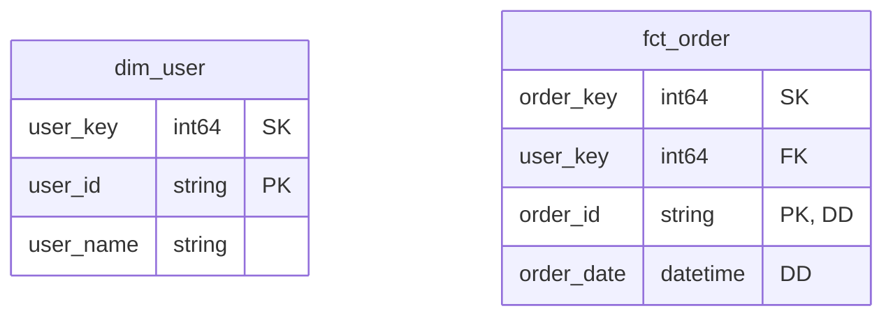

#### 2. 関係性の定義

エンティティ間の関係は矢印を使って表現します。

- `||--||`: 1 対 1 の関係（必須）
- `||--o|`: 1 対 1 の関係（オプション）
- `||--|{`: 1 対多の関係（必須）
- `||--o{`: 1 対多の関係（オプション）

```console
erDiagram

dim_user {
  user_key int64 "SK"
  user_id string "PK"
  user_name string
}

fct_order {
  order_key int64 "SK"
  user_key int64 "FK"
  order_id string "PK, DD"
  order_date datetime "DD"
}

dim_user ||--|{ fct_order : "user_key"
```

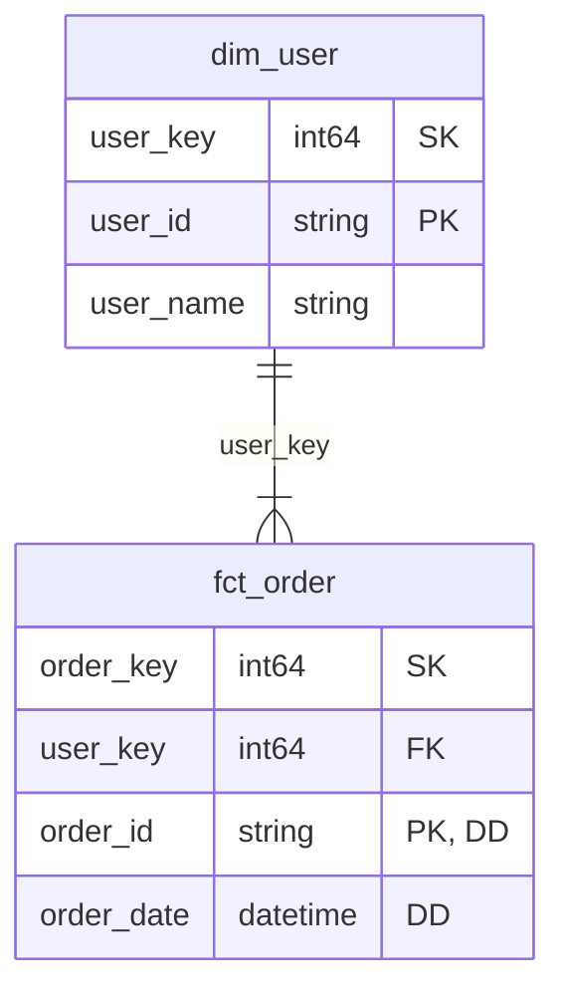

#### 3. 関係性の方向制御

エンティティの記述順序を変えることで、矢印の方向を制御できます。これは ER 図の視認性を高めるための重要なテクニックです。

```console
erDiagram

dim_user {
  user_key int64 "SK"
  user_id string "PK"
  user_name string
}

fct_order {
  order_key int64 "SK"
  user_key int64 "FK"
  order_id string "PK, DD"
  order_date datetime "DD"
}

fct_order }|--|| dim_user : "user_key"
```

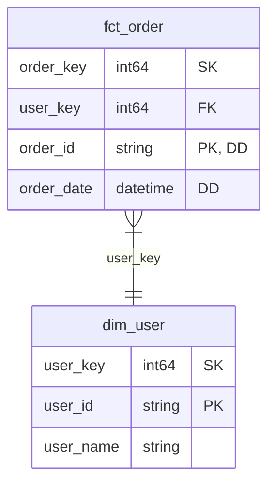

#### 4. テーマの設定

ER 図の見た目をカスタマイズするために、テーマを設定することができます。これも視認性を高めるための重要なテクニックです。

```console
erDiagram

dim_user {
  user_key int64 "SK"
  user_id string "PK"
  user_name string
}

fct_order {
  order_key int64 "SK"
  user_key int64 "FK"
  order_id string "PK, DD"
  order_date datetime "DD"
}

dim_user ||--|{ fct_order : "user_key"

%%{init: {
  "theme": "neutral",
  "themeCSS": [
    ".er.relationshipLabel { fill: black; }",
    ".er.relationshipLabelBox { fill: white; }",
    ".er.entityBox { fill: light; }",
    "[id^=entity-dim] .er.entityBox { fill: #ffbf00; }",
    "[id^=entity-fct] .er.entityBox { fill: lightblue; }"
  ]
}}%%
```

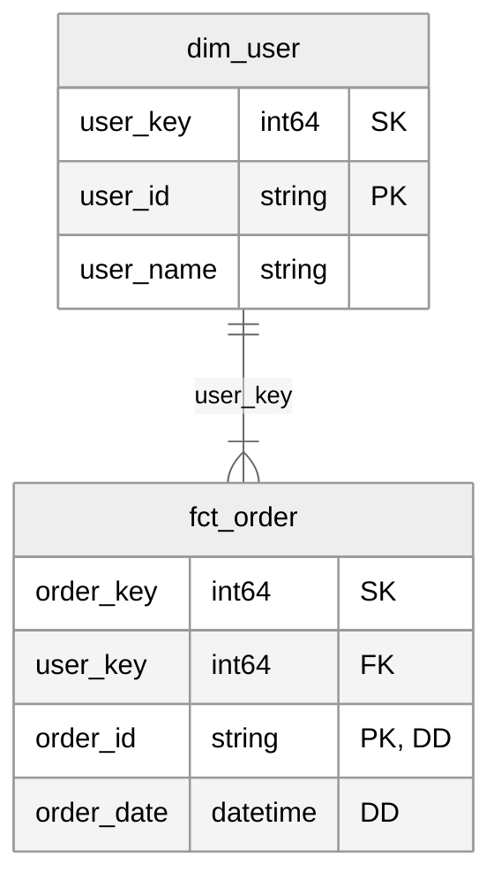

### Python で mermaid.js（ER 図） の記法を生成する

mermaid.js を Python から直接利用できる API は提供されていません。そのため、mermaid.js の ER 図記法に従ったテキストを生成するヘルパー関数を作成する必要があります。

当記事では詳細は割愛しますが、GitHub にサンプルコードを公開しているので参考にしてください。

https://github.com/tanuuuuuuu/dbt-semantic-erd/blob/main/src/erd_generator.py

## セマンティックモデルの関係性を可視化する

### 実現したいことの確認

以上の内容を踏まえて、まず物理モデル（スタースキーマ）からセマンティックモデル（※ロールプレイングディメンションを含む）を作成し、そのセマンティックモデル間の関係性を mermaid.js で可視化することを目指します。

- **データ構造:**
  - **物理モデル（dbt モデル）**: スタースキーマ
  - **論理モデル（セマンティックモデル）**: スタースキーマ
- **手段:**
  - **メタデータの取得手段**: Discovery API（dbt Cloud）
  - **プログラミング言語**: Python
  - **ER 図の可視化**: mermaid.js

### 物理モデルの構造

- データモデル: スタースキーマ（マルチスター）
- ファクトテーブル:
  - `fct_order`: 注文トランザクション・ファクトテーブル
  - `fct_access_daily`: アクセス定期スナップショット・ファクトテーブル
- ディメンションテーブル:
  - `dim_date`: 日付ディメンションテーブル（3 Role play）
  - `dim_product`: 商品ディメンションテーブル
  - `dim_user`: 顧客ディメンションテーブル

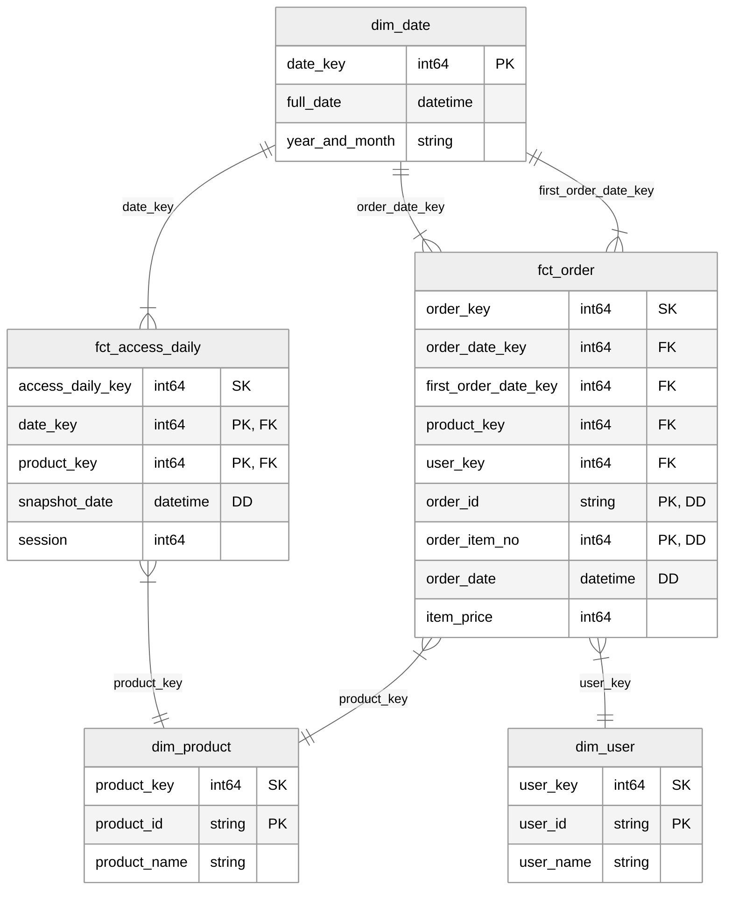

### 論理モデルへの変換

物理モデルの `dim_date` が `date_dimension` と `order_date_dimension` と `first_order_date_dimension` という 3 つの論理モデルに分割されています。


### 変換後のモデル構造

論理モデルへの変換により、セマンティックモデル間の関係性を表した ER 図は、以下のようになります。

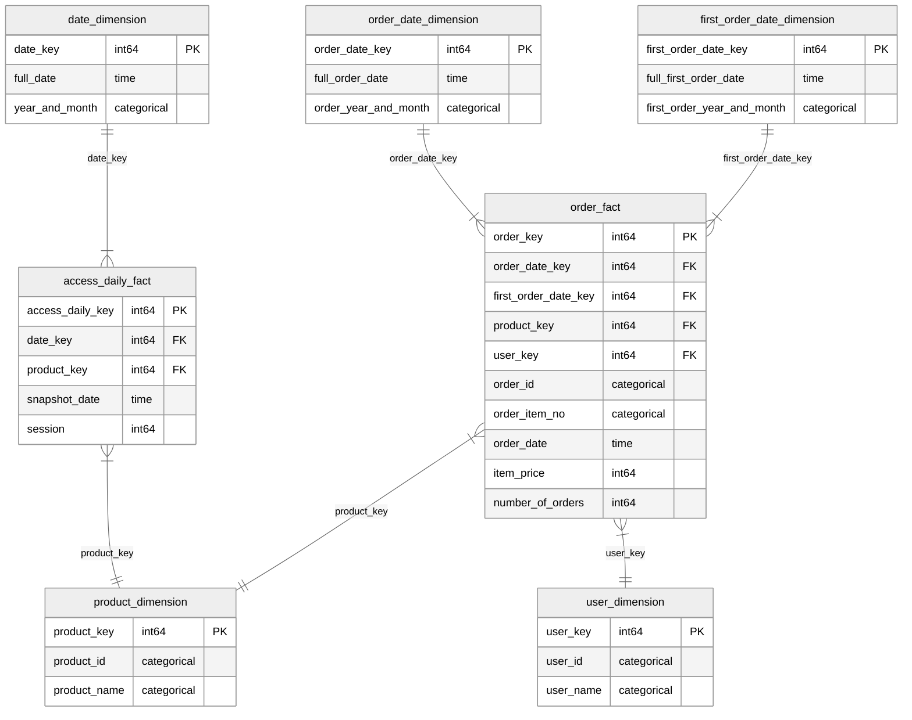

最終的なゴールは、Python で Discovery API から取得したメタデータをもとに、この ER 図を自動生成することです。

### サンプルコード

最後に、Discovery API を使ってセマンティックモデルのメタデータを取得し、mermaid.js の記法に変換する実装例をご紹介します。GitHub リポジトリにサンプルコードを公開していますので、ぜひご参照ください。

https://github.com/tanuuuuuuu/dbt-semantic-erd

#### 準備

`.env` ファイルを作成し、以下の内容を記述します。

```plain:.env
DBT_ENVIRONMENT_ID={{ YOUR_ENVIRONMENT_ID }}
DBT_DISCOVERY_API_KEY={{ YOUR_DISCOVERY_API_KEY }}
DBT_DISCOVERY_API_ENDPOINT={{ YOUR_DISCOVERY_API_ENDPOINT }}
```

Discovery API のエンドポイントは、以下のドキュメントを参考に設定してください。

https://docs.getdbt.com/docs/dbt-cloud-apis/discovery-querying#discovery-api-endpoints

#### 実行

`main.py` を実行すると、Discovery API から取得したセマンティックモデルのメタデータをもとに、mermaid.js で ER 図を描画するコードが出力されます。

```bash
$ python main.py
```

```console:出力結果
erDiagram

access_daily_fact {
  access_daily_key int64 PK
  date_key int64 FK
  product_key int64 FK
  snapshot_date time
  session int64
}

date_dimension {
  date_key int64 PK
  full_date time
  year_and_month categorical
}

first_order_date_dimension {
  first_order_date_key int64 PK
  full_first_order_date time
  first_order_year_and_month categorical
}

order_date_dimension {
  order_date_key int64 PK
  full_order_date time
  order_year_and_month categorical
}

order_fact {
  order_key int64 PK
  order_date_key int64 FK
  first_order_date_key int64 FK
  product_key int64 FK
  user_key int64 FK
  order_id categorical
  order_item_no categorical
  order_date time
  item_price int64
  number_of_orders int64
}

product_dimension {
  product_key int64 PK
  product_id categorical
  product_name categorical
}

user_dimension {
  user_key int64 PK
  user_id categorical
  user_name categorical
}

date_dimension ||--o{ access_daily_fact : "date_key"
access_daily_fact }o--|| product_dimension : "product_key"
order_fact }o--|| order_date_dimension : "order_date_key"
first_order_date_dimension ||--o{ order_fact : "first_order_date_key"
order_fact }o--|| product_dimension : "product_key"
order_fact }o--|| user_dimension : "user_key"

%%{init: {
  "theme": "neutral",
  "themeCSS": [
    ".er.relationshipLabel { fill: black; }",
    ".er.relationshipLabelBox { fill: white; }",
    ".er.entityBox { fill: light; }",
    "[id*=dimension] .er.entityBox { fill: #ffbf00; }",
    "[id*=fact] .er.entityBox { fill: lightblue; }"
  ]
}}%%
```

この出力結果を、mermaid.js を描画できる環境で使用すると、セマンティックモデルの関係性を可視化することができます。

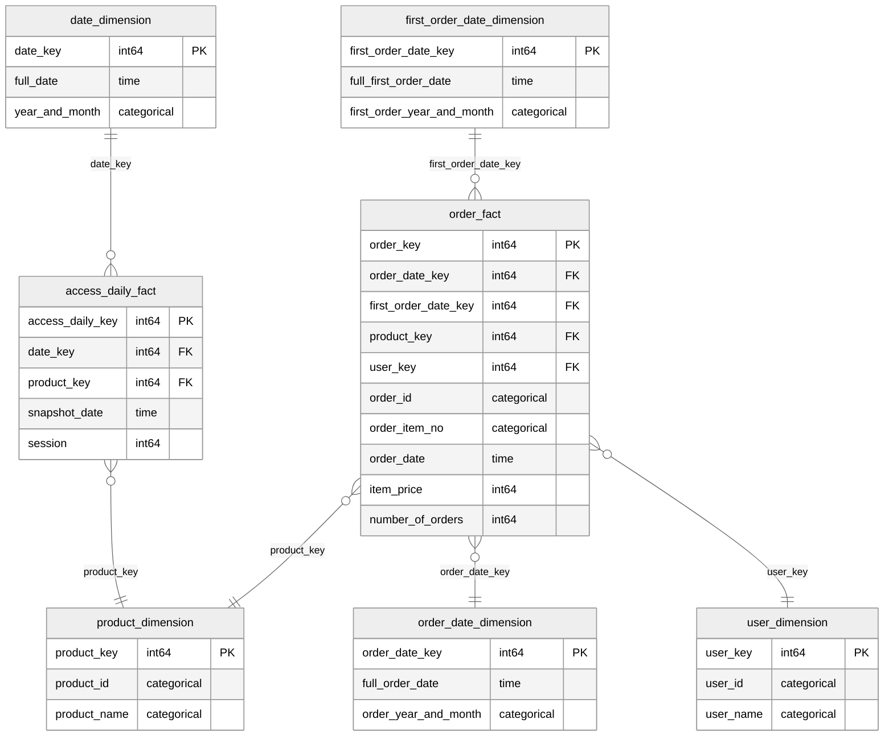

#### 工夫したポイント

- マルチホップ結合の制約を活かして、テーブルの配置を見やすく調整
  - ファクトテーブルは、必ず 2 段目に配置
  - ディメンションテーブルは、テーブル数に応じて均等に 1 段目、3 段目に配置
- ファクトテーブルは青、ディメンションテーブルは黄色でテーブルヘッダーを色分け

#### 今後の改善点

- ディメンショナルモデリング前提であるため、OBT などのデータモデリング手法に基づいたモデルの構造を反映
- CI/CD に組み込み、常に最新のセマンティックモデルを見れるようにする
- アウトリガーやスノーフレーキングなどの高度なディメンショナルデザインに対応しているかは未検証
- ページネーションの実装（セマンティックモデルが 500 個以上あるとエラーになる）

## さいごに

当記事では、dbt Cloud の Discovery API を活用してセマンティックモデルの関係性を可視化する方法について紹介しました。

このアプローチは、セマンティックレイヤーが本格的なデータカタログツールでの対応が整うまでの暫定的な対応策となりますが、セマンティックモデルの全体像を素早く把握し、データの意味やコンテキストの理解を促進できると考えています。

最後までお読みいただき、ありがとうございました。
