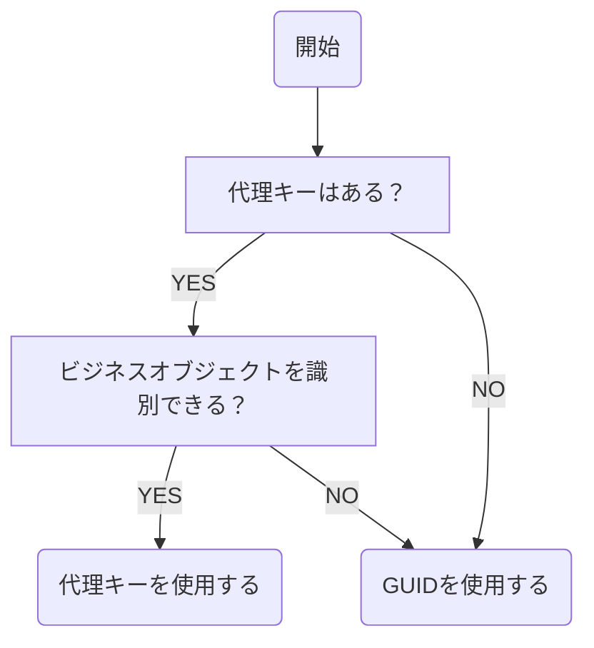

## ビジネスキーが存在しない場合



代理キー（サロゲートキー）が存在する場合、ソースシステムでビジネスオブジェクトを識別するために代理キーを使用している場合に限り、代理キーをビジネスキーとして格納することが可能です。

また、ソースデータにビジネスキーが存在しない場合（e.g., 広告レポート、手動入力のオフラインデータなど）は、GUID（Globally Unique Identifier, グローバル一意識別子）をビジネスキーとして格納します。

```py:GUID(Python)
import uuid

uuid.uuid4()
```

```sql:GUID(BigQuery)
generate_uuid()
```

```sql:GUID(Snowflake)
uuid_string()
```
