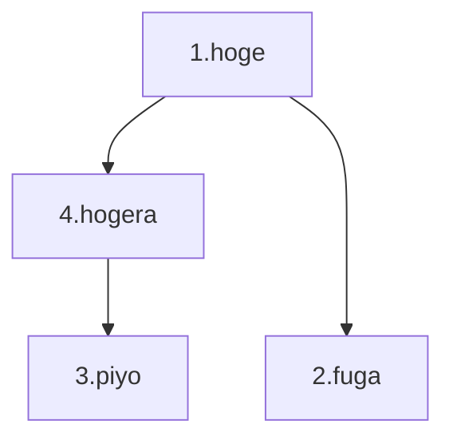
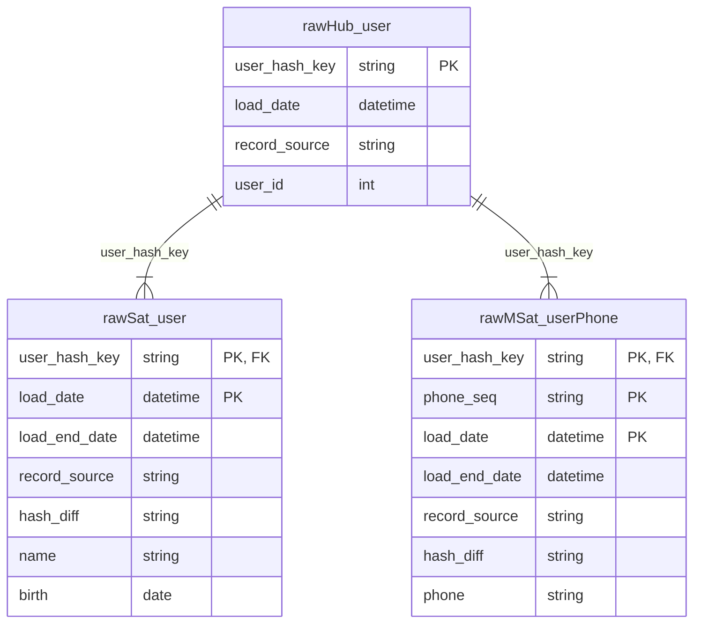

Raw Vault の目的は、異なるデータソース間のデータ構造を統合することです。


# 🔶 Hub（ハブ）
Hub エンティティは、ビジネスオブジェクトのコアをモデル化したもので、具体的にはビジネスオブジェクトを識別する 1 つまたは複数のビジネスキーを格納します。


## テーブル構造

Hub を構成する属性は、以下の通りです。

| Column | Type | Description |
|--------|------|-------------|
| **Multi-tenant id** | `string` | マルチテナント ID。1 つのテナントの場合、`default` を指定。 |
| **Business key collision code** | `string` | ビジネスキー衝突防止コード。ビジネスキーを生成するソースが 1 つしかない場合、`default` を指定。　|
| **Hash key(PK)** | `binary` | ビジネスオブジェクトを識別するハッシュベースの代理キー。　|
| **Load date** | `datetime` | ビジネスキーがステージングに到着したときの最初の日時。 |
| **Record source** | `string` | ビジネスキーを供給した最初の記録ソース。 |
| **Business Key(s)** | `string` | 1 つまたは、複数のビジネスキー（複合キー、スマートキー）。 |
| \<Applied timestamp\> | `datetime` | ソースバッチファイルのタイムスタンプ。 |
| \<Task id\> | `string` | ビジネスオブジェクトを供給した最初のタスク ID。 |
| \<User id\> | `string` | ビジネスオブジェクトを供給した最初のユーザー ID。 |
| \<JIRA id\> | `string` | ビジネスオブジェクトを供給した最初の JIRA タスク ID。 |
| \[Last seen date\] | `datetime` | ビジネスキーがステージングに到着したときの最後の日時。 |

- `<>`: オプション
- `[]`: 非推奨


## 命名基準
- Hub: `h_`, **`hub_`**


## モデリング

この記事では、Hub、Link、Satellite 章の各モデリング節にて、Raw Vault の基本形のモデリングの手順について、共通のサンプル CSV データを用いています。

データの概要は「架空のオンラインショップの購買履歴データ」と想像して読み進めてください。


### 1. 初回ロード

```plain:OrderReport.csv
| order_id | order_item_no | order_date          | order_status | shipping_cost | order_price | product_id | product_name | product_price | item_quantity | item_price | user_id | user_name |
|----------|---------------|---------------------|--------------|---------------|-------------|------------|--------------|---------------|---------------|------------|---------|-----------|
| 1        | 1             | 2022-12-31 9:00:00  | shipped      | 300           | 1800        | a          | Apple        | 1000          | 1             | 1000       | A       | hoge      |
| 1        | 2             | 2022-12-31 9:00:00  | shipped      | 300           | 1800        | b          | Banana       | 500           | 1             | 500        | A       | hoge      |
| 2        | 1             | 2022-12-31 19:00:00 | pending      | 300           | 2300        | a          | Apple        | 1000          | 2             | 2000       | B       | fuga      |
```

ビジネスオブジェクトの構造を把握するために正規化します。


この CSV ファイルの構造から、3 種類のビジネスキーが見つかったので、3 つの Hub を特定することができました。

1. `order_id`
2. `product_id`
3. `user_id`

:::message alert
従属子キー `order_item_no` は、ビジネスキーではありません。
:::

↓ Data Vault モデリング


```plain:🔶 hub_order
| dv_tenantid | dv_bkcc | dv_hashkey_order            | dv_loadts                  | dv_recsrc       | order_id |
|-------------|---------|-----------------------------|----------------------------|-----------------|----------|
| default     | default | hash("default||default||1") | 2023-01-01T00:00:00.000000 | OrderReport.csv | 1        |
| default     | default | hash("default||default||2") | 2023-01-01T00:00:00.000000 | OrderReport.csv | 2        |
```

```plain:🔶 hub_product
| dv_tenantid | dv_bkcc | dv_hashkey_product          | dv_loadts                  | dv_recsrc       | product_id |
|-------------|---------|-----------------------------|----------------------------|-----------------|------------|
| default     | default | hash("default||default||a") | 2023-01-01T00:00:00.000000 | OrderReport.csv | a          |
| default     | default | hash("default||default||b") | 2023-01-01T00:00:00.000000 | OrderReport.csv | b          |
```

```plain:🔶 hub_user
| dv_tenantid | dv_bkcc | dv_hashkey_user             | dv_loadts                  | dv_recsrc       | user_id    |
|-------------|---------|-----------------------------|----------------------------|-----------------|------------|
| default     | default | hash("default||default||A") | 2023-01-01T00:00:00.000000 | OrderReport.csv | A          |
| default     | default | hash("default||default||B") | 2023-01-01T00:00:00.000000 | OrderReport.csv | B          |
```

### 2. 2 回目以降のロード

Hub エンティティに、新しいエントリーをロードする流れを見てみます。

```plain:OrderReport.csv（更新データ）
| order_id | order_item_no | order_date          | order_status | shipping_cost | order_price | product_id | product_name | product_price | item_quantity | item_price | user_id | user_name |
|----------|---------------|---------------------|--------------|---------------|-------------|------------|--------------|---------------|---------------|------------|---------|-----------|
| 2        | 1             | 2022-12-31 19:00:00 | shipped      | 300           | 2300        | a          | Apple        | 1000          | 2             | 2000       | B       | fuga      |
| 3        | 1             | 2023-01-01 3:00:00  | shipped      | 300           | 800         | b          | Banana       | 500           | 1             | 500        | C       | piyo      |
```
この更新データには、新しい注文データと過去の注文データの変更が含まれています。

- 注文 ID が `3` である注文データの追加
- 注文 ID が `2` である注文データの注文ステータスが `pending` から `shipped` に変更

↓ Data Vault モデリング

```plain:🔶 hub_order（追加）
| dv_tenantid | dv_bkcc | dv_hashkey_order            | dv_loadts                  | dv_recsrc       | order_id |
|-------------|---------|-----------------------------|----------------------------|-----------------|----------|
| default     | default | hash("default||default||1") | 2023-01-01T00:00:00.000000 | OrderReport.csv | 1        |
| default     | default | hash("default||default||2") | 2023-01-01T00:00:00.000000 | OrderReport.csv | 2        |
| default     | default | hash("default||default||3") | 2023-01-02T00:00:00.000000 | OrderReport.csv | 3        |
```

```plain:🔶 hub_product（追加なし）
| dv_tenantid | dv_bkcc | dv_hashkey_product          | dv_loadts                  | dv_recsrc       | product_id |
|-------------|---------|-----------------------------|----------------------------|-----------------|------------|
| default     | default | hash("default||default||a") | 2023-01-01T00:00:00.000000 | OrderReport.csv | a          |
| default     | default | hash("default||default||b") | 2023-01-01T00:00:00.000000 | OrderReport.csv | b          |
```

```plain:🔶 hub_user（追加）
| dv_tenantid | dv_bkcc | dv_hashkey_user             | dv_loadts                  | dv_recsrc       | user_id    |
|-------------|---------|-----------------------------|----------------------------|-----------------|------------|
| default     | default | hash("default||default||A") | 2023-01-01T00:00:00.000000 | OrderReport.csv | A          |
| default     | default | hash("default||default||B") | 2023-01-01T00:00:00.000000 | OrderReport.csv | B          |
| default     | default | hash("default||default||C") | 2023-01-02T00:00:00.000000 | OrderReport.csv | C          |
```


# 🔗 Link（リンク）
Link エンティティは、2 つ以上のビジネスオブジェクト（Hub）間の関係や関連性をモデル化したものです。（同じ Hub を 2 回以上使用することも可能です。）


## テーブル構造
Link エンティティを構成する属性は以下の通りです。

| Column | Type | Description |
|--------|------|-------------|
| **Multi-tenant id** | `string` | マルチテナント ID。1 つのテナントの場合、`default` を指定。 |
| **Link Hash key(PK)** | `binary` | ビジネスオブジェクトの関連性を識別するハッシュベースの代理キー。　|
| **Load date** | `datetime` | ビジネスオブジェクトの関連性がステージングに到着したときの最初の日時。 |
| **Record source** | `string` | ビジネスオブジェクトの関連性を供給した最初の記録ソース。 |
| **Hub Hash Keys(FK)** | `string` | ビジネスオブジェクトの関連性を表す 2 つ以上の代理キー。 |
| \<Applied timestamp\> | `datetime` | ソースバッチファイルのタイムスタンプ。 |
| \<Task id\> | `string` | ビジネスオブジェクトの関連性を供給した最初のタスク ID。 |
| \<User id\> | `string` | ビジネスオブジェクトの関連性を供給した最初のユーザー ID。 |
| \<JIRA id\> | `string` | ビジネスオブジェクトの関連性を供給した最初の JIRA タスク ID。 |
| \[Last seen date\] | `datetime` | ビジネスオブジェクトの関連性がステージングに到着したときの最後の日時。 |
| \<Dependent-child key(s)\> | `any` | 従属子キー。リレーションシップをより明確にするために使用される 1 つまたは複数のキー。 |

- `<>`: オプション
- `[]`: 非推奨

:::message
ビジネスキー衝突防止コード（`Business key collision code`）は、ハッシュキーに含まれているので不要です。
:::


## 命名基準
- Link: `l_`, **`lnk_`**
- Same-As Link: `l_`, `lnk_`, `sal_`, **`lnks_`**
- Hierarchy Link: `l_`, `lnk_`, `hal_`, **`lnkh_`**


## モデリング

Hub 章のモデリング節と同様のデータを用いて、Link エンティティのモデリングを見てみます。

### 1. 初回ロード
```plain:OrderReport.csv
| order_id | order_item_no | order_date          | order_status | shipping_cost | order_price | product_id | product_name | product_price | item_quantity | item_price | user_id | user_name |
|----------|---------------|---------------------|--------------|---------------|-------------|------------|--------------|---------------|---------------|------------|---------|-----------|
| 1        | 1             | 2022-12-31 9:00:00  | shipped      | 300           | 1800        | a          | Apple        | 1000          | 1             | 1000       | A       | hoge      |
| 1        | 2             | 2022-12-31 9:00:00  | shipped      | 300           | 1800        | b          | Banana       | 500           | 1             | 500        | A       | hoge      |
| 2        | 1             | 2022-12-31 19:00:00 | pending      | 300           | 2300        | a          | Apple        | 1000          | 2             | 2000       | B       | fuga      |
```


この CSV ファイルの構造から、ビジネスキーの間に、2 つの関連性の作業単位（Unit-of-work）を特定することができました。

1. `order_id`, `product_id`
2. `order_id`, `user_id`

↓ Data Vault モデリング


Hub テーブルは割愛。

```plain:🔗 lnk_order_product
| dv_tenantid | dv_hashkey_order_product                          | dv_loadts                  | dv_recsrc       | dv_hashkey_order            | dv_hashkey_product           |
|-------------|---------------------------------------------------|----------------------------|-----------------|-----------------------------|------------------------------|
| default     | hash("default||default||1||default||default||a")  | 2023-01-01T00:00:00.000000 | OrderReport.csv | hash("default||default||1") | hash("default||default||a")  |
| default     | hash("default||default||1||default||default||b")  | 2023-01-01T00:00:00.000000 | OrderReport.csv | hash("default||default||1") | hash("default||default||b")  |
| default     | hash("default||default||2||default||default||a")  | 2023-01-01T00:00:00.000000 | OrderReport.csv | hash("default||default||2") | hash("default||default||a")  |
```

```plain:🔗 lnk_order_user
| dv_tenantid | dv_hashkey_order_user                             | dv_loadts                  | dv_recsrc       | dv_hashkey_order            | dv_hashkey_user              |
|-------------|---------------------------------------------------|----------------------------|-----------------|-----------------------------|------------------------------|
| default     | hash("default||default||1||default||default||A")  | 2023-01-01T00:00:00.000000 | OrderReport.csv | hash("default||default||1") | hash("default||default||A")  |
| default     | hash("default||default||2||default||default||B")  | 2023-01-01T00:00:00.000000 | OrderReport.csv | hash("default||default||2") | hash("default||default||B")  |
```

### 2. 2 回目以降のロード

Link エンティティに、新しいエントリーをロードする流れを見てみます。

```plain:OrderReport.csv（更新データ）
| order_id | order_item_no | order_date          | order_status | shipping_cost | order_price | product_id | product_name | product_price | item_quantity | item_price | user_id | user_name |
|----------|---------------|---------------------|--------------|---------------|-------------|------------|--------------|---------------|---------------|------------|---------|-----------|
| 2        | 1             | 2022-12-31 19:00:00 | shipped      | 300           | 2300        | a          | Apple        | 1000          | 2             | 2000       | B       | fuga      |
| 3        | 1             | 2023-01-01 3:00:00  | shipped      | 300           | 800         | b          | Banana       | 500           | 1             | 500        | C       | piyo      |
```
この更新データには、新しい注文データと過去の注文データの変更が含まれています。

- 注文 ID が `3` である注文データの追加
- 注文 ID が `2` である注文データの注文ステータスが `pending` から `shipped` に変更

↓ Data Vault モデリング

Hub テーブルは割愛。

```plain:🔗 lnk_order_product（追加）
| dv_tenantid | dv_hashkey_order_product                          | dv_loadts                  | dv_recsrc       | dv_hashkey_order            | dv_hashkey_product           |
|-------------|---------------------------------------------------|----------------------------|-----------------|-----------------------------|------------------------------|
| default     | hash("default||default||1||default||default||a")  | 2023-01-01T00:00:00.000000 | OrderReport.csv | hash("default||default||1") | hash("default||default||a")  |
| default     | hash("default||default||1||default||default||b")  | 2023-01-01T00:00:00.000000 | OrderReport.csv | hash("default||default||1") | hash("default||default||b")  |
| default     | hash("default||default||2||default||default||a")  | 2023-01-01T00:00:00.000000 | OrderReport.csv | hash("default||default||2") | hash("default||default||a")  |
| default     | hash("default||default||3||default||default||a")  | 2023-01-02T00:00:00.000000 | OrderReport.csv | hash("default||default||3") | hash("default||default||a")  |
```

```plain:🔗 lnk_order_user（追加）
| dv_tenantid | dv_hashkey_order_user                             | dv_loadts                  | dv_recsrc       | dv_hashkey_order            | dv_hashkey_user              |
|-------------|---------------------------------------------------|----------------------------|-----------------|-----------------------------|------------------------------|
| default     | hash("default||default||1||default||default||A")  | 2023-01-01T00:00:00.000000 | OrderReport.csv | hash("default||default||1") | hash("default||default||A")  |
| default     | hash("default||default||2||default||default||B")  | 2023-01-01T00:00:00.000000 | OrderReport.csv | hash("default||default||2") | hash("default||default||B")  |
| default     | hash("default||default||3||default||default||C")  | 2023-01-02T00:00:00.000000 | OrderReport.csv | hash("default||default||3") | hash("default||default||C")  |
```

## 🔗 Same-As Link（同一リンク）
Same-As Link は、Link テーブルの基本形の別バリエーションで、同じビジネスオブジェクトを示す複数のビジネスキーが存在するときの関係性をモデル化したものになります。

**ビジネスキーの統合**が Same-As Link の目的です。

:::message
テーブル構造は、Link の基本形と同じです。
:::

### 1. 異なるデータソース間のビジネスキーを統合する

下の 2 つのテーブルは、同じユーザーが複数の業務システムで存在し、異なるユーザー ID が割り当てられていると考えてください。

```plain:システム A
| user_id | name | age |
|---------|------|-----|
| 1       | hoge | 25  |
| 2       | fuga | 30  |
| 3       | piyo | 35  |
```

```plain:システム B
| user_id | name | dept      |
|---------|------|-----------|
| 9604    | hoge | engineer  |
| 8759    | fuga | marketing |
| 1432    | piyo | engineer  |
```

異なるデータソース間でビジネスキーを統合するには、MDM（マスターデータ管理）で、次のようなユーザー ID のマッピングテーブルを作成します。

```plain:MDM
| system_a | system_b |
|----------|----------|
| 1        | 9604     |
| 2        | 8759     |
| 3        | 1432     |
```

↓ Data Vault モデリング


```plain:🔶 hub_user
| dv_tenantid | dv_bkcc | dv_hashkey_user          | dv_loadts                  | dv_recsrc | user_id |
|-------------|---------|--------------------------|----------------------------|-----------|---------|
| default     | a       | hash("default||a||1")    | 2023-01-01T00:00:00.000000 | System A  | 1       |
| default     | a       | hash("default||a||2")    | 2023-01-01T00:00:00.000000 | System A  | 2       |
| default     | a       | hash("default||a||3")    | 2023-01-01T00:00:00.000000 | System A  | 3       |
| default     | b       | hash("default||b||9604") | 2023-01-01T00:00:00.000000 | System B  | 9604    |
| default     | b       | hash("default||b||8759") | 2023-01-01T00:00:00.000000 | System B  | 8759    |
| default     | b       | hash("default||b||1432") | 2023-01-01T00:00:00.000000 | System B  | 1432    |
```

```plain:🔗 lnks_user
| dv_tenantid | dv_hashkey_lnks_user                    | dv_loadts                  | dv_recsrc | dv_hashkey_a_user     | dv_hashkeyb_user         |
|-------------|-----------------------------------------|----------------------------|-----------|-----------------------|--------------------------|
| default     | hash("default||a||1||default||b||9604") | 2023-01-01T00:00:00.000000 | MDM       | hash("default||a||1") | hash("default||b||9604") |
| default     | hash("default||a||2||default||b||8759") | 2023-01-01T00:00:00.000000 | MDM       | hash("default||a||2") | hash("default||b||8759") |
| default     | hash("default||a||3||default||b||1432") | 2023-01-01T00:00:00.000000 | MDM       | hash("default||a||3") | hash("default||b||1432") |
```


### 2. フォーマットが異なるビジネスキーを統合する

ソースシステムが、同じビジネスオブジェクトに対して異なるフォーマットのビジネスキーをサポートする場合も Same-As Link でビジネスキーを統合することができます。

次のテーブルは、返品されると前のデータはそのまま残り、新しく返品データ（ `[business_key]_001`）が追加されると考えてください。

```plain:システム A
| order_id | status   | amount | updated_at                 |
|----------|----------|--------|----------------------------|
| 1        | shipped  | 10000  | 2022-12-31T00:00:00.000000 |
| 1-001    | returned | -10000 | 2023-01-01T00:00:00.000000 |
| 2        | shipped  | 5000   | 2022-12-31T00:00:00.000000 |
```

このケースの場合、MDM でマッピングテーブルを用意しなくても、SQL でマッピングテーブルを用意することできます。

```plain: マッピングテーブル
| original | alias  |
|----------|--------|
| 1        | 1-001  |
```

↓ Data Vault モデリング


```plain:🔶 hub_order
| dv_tenantid | dv_bkcc | dv_hashkey_order                | dv_loadts                  | dv_recsrc | order_id |
|-------------|---------|---------------------------------|----------------------------|-----------|----------|
| default     | default | hash("default||default||1")     | 2023-01-01T00:00:00.000000 | System A  | 1        |
| default     | default | hash("default||default||1-001") | 2023-01-02T00:00:00.000000 | System A  | 1-001    |
| default     | default | hash("default||default||2")     | 2023-01-01T00:00:00.000000 | System A  | 2        |
```

```plain:🔗 lnks_order
| dv_tenantid | dv_hashkey_lnks_order                                | dv_loadts                  | dv_recsrc | dv_hashkey_original         | dv_hashkey_alias                |
|-------------|------------------------------------------------------|----------------------------|-----------|-----------------------------|---------------------------------|
| default     | hash("default||default||1||default||default||1-001") | 2023-01-02T00:00:00.000000 | SYSTEM    | hash("default||default||1") | hash("default||default||1-001") |
```


## 🔗 Hierarchy Link（階層リンク）

Hierarchy Link は、Link テーブルの基本形の別バリエーションで、同じ意味粒度のビジネスオブジェクト間の親子階層をモデル化したものになります。

:::message
テーブル構造は、Link の基本形と同じです。
:::

従業員や組織図、製品カテゴリなどの親子階層を表現することできます。

```plain:システム A
| user_id | name   | dept      | manager_id |
|---------|--------|-----------|------------|
| 1       | hoge   | engineer  | null       |
| 2       | fuga   | marketing | 1          |
| 3       | piyo   | engineer  | 4          |
| 4       | hogera | engineer  | 1          |
```

このデータから、ユーザー ID `1` は、 `2` と `4` の直属の上司であり、`4` は `3` の直属の上司であることが分かります。



↓ Data Vault モデリング


```plain:🔶 hub_user
| dv_tenantid | dv_bkcc | dv_hashkey_user             | dv_loadts                  | dv_recsrc  | user_id |
|-------------|---------|-----------------------------|----------------------------|------------|---------|
| default     | default | hash("default||default||1") | 2023-01-01T00:00:00.000000 | System A   | 1       |
| default     | default | hash("default||default||2") | 2023-01-01T00:00:00.000000 | System A   | 2       |
| default     | default | hash("default||default||3") | 2023-01-01T00:00:00.000000 | System A   | 3       |
| default     | default | hash("default||default||4") | 2023-01-01T00:00:00.000000 | System A   | 4       |
```

```plain:🔗 lnkh_user
| dv_tenantid | dv_hashkey_lnkh_user                             | dv_loadts                  | dv_recsrc  | dv_hashkey_employee         | dv_hashkey_manager          |
|-------------|--------------------------------------------------|----------------------------|------------|-----------------------------|-----------------------------|
| default     | hash("default||default||1||default||default||")  | 2023-01-01T00:00:00.000000 | System A   | hash("default||default||1") | hash("default||default||")  |
| default     | hash("default||default||2||default||default||1") | 2023-01-01T00:00:00.000000 | System A   | hash("default||default||2") | hash("default||default||1") |
| default     | hash("default||default||3||default||default||4") | 2023-01-01T00:00:00.000000 | System A   | hash("default||default||3") | hash("default||default||4") |
| default     | hash("default||default||4||default||default||1") | 2023-01-01T00:00:00.000000 | System A   | hash("default||default||4") | hash("default||default||1") |
```


# 🛰️ Satellite（サテライト）
Satellite エンティティは、ビジネスオブジェクトのコンテキストをモデル化したもので、コンテキストとその変更履歴を全て記録します。（Satellite はデルタドリブンで、ディメンションモデリングにおける **Type 2 SCD** に相当します。）


:::message
Hub から伸びている Satellite を **Hub Satellite**、 Link から伸びている Satellite を **Link Satellite** と呼ぶこともあります。
:::


### テーブル構造

Satellite エンティティを構成する属性は以下の通りです。

| Column | Type | Description |
|--------|------|-------------|
| **Multi-tenant id** | `string` | マルチテナント ID。1 つのテナントの場合、`default` を指定。 |
| **Hash key(PK, FK)** | `binary` | a |
| **Load date(PK)** | `datetime` | a |
| **Load-end date** | `datetime` | a |
| **Record source** | `string` | a |
| **Hash difference** | `binary` | a |
| \<Applied timestamp\> | `datetime` | a |
| \<Task id\> | `string` | a |
| \<User id\> | `string` | a |
| \<Dependent-child key(s)\> | `any` | a |
| **Attributes** | `any` | a |

- `<>`: オプション
- `[]`: 非推奨


## 命名基準
- Satellite: `s_`, **`sat_`**
- Non-Historized Link / Satellite: **`lnkn_`** / **`satn_`**
- Multi-Active Satellite: `mas_`, **`satm_`**
- Status Tracking Satellite: `sts_`, **`sats_`**
- Record Tracking Satellite: `rts_`, **`satr_`**
- Effective Satellite: `efs_`, **`sate_`**
- Extended Record Tracking Satellite: `xts_`, **`satx_`**


## Load-end date（ロード終了日）

`Load-end date` には、そのエントリーが DWH で有効だった最後の日時を記録する役割があります。

:::message alert
`Load-end date` は、ソースシステムの有効期限を記録するものではないことに注意しましょう。
:::

最新のエントリーの`Load-end date` には、`null` または　`9999-12-31` などの値が格納され、その直前のエントリーの `Load-end date` には、最新のエントリーの `Load date` の値（または -1 マイクロ秒など）が格納されます。

```
| dv_hashkey_order            | dv_loadts                  | dv_loadendts               | order_status |
|-----------------------------|----------------------------|----------------------------|--------------|
| hash("default||default||1") | 2023-01-01T00:00:00.000000 | null                       | shipped      |
| hash("default||default||2") | 2023-01-01T00:00:00.000000 | 2023-01-01T23:59:59.999999 | pending      |
| hash("default||default||2") | 2023-01-02T00:00:00.000000 | null                       | shipped      |
```

例えば、このようにデータが記録されていれば、二行目のエントリーは、`2023-01-01T00:00:00.000000` から `2023-01-01T23:59:59.999999` まで　DWH でアクティブだったということが分かります。


## モデリング

### 1. 初回ロード
Hub、Link 章のモデリング節と同様のデータを用いて、Satellite エンティティのモデリングを見てみます。

```plain:OrderReport.csv
| order_id | order_item_no | order_date          | order_status | shipping_cost | order_price | product_id | product_name | product_price | item_quantity | item_price | user_id | user_name |
|----------|---------------|---------------------|--------------|---------------|-------------|------------|--------------|---------------|---------------|------------|---------|-----------|
| 1        | 1             | 2022-12-31 9:00:00  | shipped      | 300           | 1800        | a          | Apple        | 1000          | 1             | 1000       | A       | hoge      |
| 1        | 2             | 2022-12-31 9:00:00  | shipped      | 300           | 1800        | b          | Banana       | 500           | 1             | 500        | A       | hoge      |
| 2        | 1             | 2022-12-31 19:00:00 | pending      | 300           | 2300        | a          | Apple        | 1000          | 2             | 2000       | B       | fuga      |
```


この CSV ファイルの構造から、ビジネスオブジェクトのコンテキストを特定することができました。

1. hub_order
	- `order_date`
	- `order_status`
	- `shipping_cost`
	- `order_price`
2. hub_product
	- `product_name`
	- `product_price`
3. hub_user
	- `user_name`
4. lnk_order_product
	- `order_item_no`
	- `item_quantity`
	- `item_price`

↓ Data Vault モデリング


Hub、Link テーブルは割愛。

```plain:🛰️ sat_default_default_order
| dv_tenantid | dv_hashkey_order            | dv_loadts                  | dv_loadendts | dv_recsrc       | dv_hashdiff                                                          | order_date          | order_status | shipping_cost | order_price |
|-------------|-----------------------------|----------------------------|--------------|-----------------|----------------------------------------------------------------------|---------------------|--------------|---------------|-------------|
| default     | hash("default||default||1") | 2023-01-01T00:00:00.000000 | null         | OrderReport.csv | hash("default||default||1||2022-12-31T09:00:00||shipped||300||1800") | 2022-12-31T09:00:00 | shipped      | 300           | 1800        |
| default     | hash("default||default||2") | 2023-01-01T00:00:00.000000 | null         | OrderReport.csv | hash("default||default||2||2022-12-31T19:00:00||pending||300||2300") | 2022-12-31T19:00:00 | pending      | 300           | 2300        |
```

```plain:🛰️ sat_default_default_product
| dv_tenantid | dv_hashkey_product          | dv_loadts                  | dv_loadendts | dv_recsrc       | dv_hashdiff                              | product_name | product_price |
|-------------|-----------------------------|----------------------------|--------------|-----------------|------------------------------------------|--------------|---------------|
| default     | hash("default||default||a") | 2023-01-01T00:00:00.000000 | null         | OrderReport.csv | hash("default||default||a||Apple||1000") | Apple        | 1000          |
| default     | hash("default||default||b") | 2023-01-01T00:00:00.000000 | null         | OrderReport.csv | hash("default||default||b||Banana||500") | Bnana        | 500           |
```

```plain:🛰️ sat_default_default_user
| dv_tenantid | dv_hashkey_user             | dv_loadts                  | dv_loadendts | dv_recsrc       | dv_hashdiff                       | user_name |
|-------------|-----------------------------|----------------------------|--------------|-----------------|-----------------------------------|-----------|
| default     | hash("default||default||A") | 2023-01-01T00:00:00.000000 | null         | OrderReport.csv | hash("default||default||A||hoge") | hoge      |
| default     | hash("default||default||B") | 2023-01-01T00:00:00.000000 | null         | OrderReport.csv | hash("default||default||B||fuga") | fuga      |
```

```plain:🛰️ sat_default_default_orderItem
| dv_tenantid | dv_hashkey_order_product                         | dv_loadts                  | dv_loadendts | dv_recsrc       | dv_hashdiff                                                  | order_item_no | item_quantity | item_price |
|-------------|--------------------------------------------------|----------------------------|--------------|-----------------|--------------------------------------------------------------|---------------|---------------|------------|
| default     | hash("default||default||1||default||default||a") | 2023-01-01T00:00:00.000000 | null         | OrderReport.csv | hash("default||default||1||default||default||a||1||1||1000") | 1             | 1             | 1000       |
| default     | hash("default||default||1||default||default||b") | 2023-01-01T00:00:00.000000 | null         | OrderReport.csv | hash("default||default||1||default||default||b||2||1||500")  | 2             | 1             | 500        |
| default     | hash("default||default||2||default||default||a") | 2023-01-01T00:00:00.000000 | null         | OrderReport.csv | hash("default||default||2||default||default||a||1||2||2000") | 1             | 2             | 2000       |
```

### 2. 2 回目以降のロード

Satellite エンティティに、新しいエントリーをロードする場合、更新データを追加したあとに `Load-end date` 列を更新する必要があります。

```plain:OrderReport.csv（更新データ）
| order_id | order_item_no | order_date          | order_status | shipping_cost | order_price | product_id | product_name | product_price | item_quantity | item_price | user_id | user_name |
|----------|---------------|---------------------|--------------|---------------|-------------|------------|--------------|---------------|---------------|------------|---------|-----------|
| 2        | 1             | 2022-12-31 19:00:00 | shipped      | 300           | 2300        | a          | Apple        | 1000          | 2             | 2000       | B       | fuga      |
| 3        | 1             | 2023-01-01 3:00:00  | shipped      | 300           | 800         | b          | Banana       | 500           | 1             | 500        | C       | piyo      |
```
この更新データには、新しい注文データと過去の注文データの変更が含まれています。

- 注文 ID が `3` である注文データの追加
- 注文 ID が `2` である注文データの注文ステータスが `pending` から `shipped` に変更


↓ Data Vault モデリング

Hub、Link は割愛。

```plain:🛰️ sat_default_default_order（追加、更新）
| dv_tenantid | dv_hashkey_order            | dv_loadts                  | dv_loadendts               | dv_recsrc       | dv_hashdiff                                                          | order_date          | order_status | shipping_cost | order_price |
|-------------|-----------------------------|----------------------------|----------------------------|-----------------|----------------------------------------------------------------------|---------------------|--------------|---------------|-------------|
| default     | hash("default||default||1") | 2023-01-01T00:00:00.000000 | null                       | OrderReport.csv | hash("default||default||1||2022-12-31T09:00:00||shipped||300||1800") | 2022-12-31T09:00:00 | shipped      | 300           | 1800        |
| default     | hash("default||default||2") | 2023-01-01T00:00:00.000000 | 2023-01-01T23:59:59.999999 | OrderReport.csv | hash("default||default||2||2022-12-31T19:00:00||pending||300||2300") | 2022-12-31T19:00:00 | pending      | 300           | 2300        |
| default     | hash("default||default||2") | 2023-01-02T00:00:00.000000 | null                       | OrderReport.csv | hash("default||default||2||2022-12-31T19:00:00||shipped||300||2300") | 2022-12-31T19:00:00 | shipped      | 300           | 2300        |
| default     | hash("default||default||3") | 2023-01-02T00:00:00.000000 | null                       | OrderReport.csv | hash("default||default||3||2023-01-01T03:00:00||shipped||300||800")  | 2023-01-01T03:00:00 | shipped      | 300           | 800         |
```

```plain:🛰️ sat_default_default_product（追加なし）
| dv_tenantid | dv_hashkey_product          | dv_loadts                  | dv_loadendts | dv_recsrc       | dv_hashdiff                              | product_name | product_price |
|-------------|-----------------------------|----------------------------|--------------|-----------------|------------------------------------------|--------------|---------------|
| default     | hash("default||default||a") | 2023-01-01T00:00:00.000000 | null         | OrderReport.csv | hash("default||default||a||Apple||1000") | Apple        | 1000          |
| default     | hash("default||default||b") | 2023-01-01T00:00:00.000000 | null         | OrderReport.csv | hash("default||default||b||Banana||500") | Bnana        | 500           |
```

```plain:🛰️ sat_default_default_user（追加）
| dv_tenantid | dv_hashkey_user             | dv_loadts                  | dv_loadendts | dv_recsrc       | dv_hashdiff                       | user_name |
|-------------|-----------------------------|----------------------------|--------------|-----------------|-----------------------------------|-----------|
| default     | hash("default||default||A") | 2023-01-01T00:00:00.000000 | null         | OrderReport.csv | hash("default||default||A||hoge") | hoge      |
| default     | hash("default||default||B") | 2023-01-01T00:00:00.000000 | null         | OrderReport.csv | hash("default||default||B||fuga") | fuga      |
| default     | hash("default||default||C") | 2023-01-02T00:00:00.000000 | null         | OrderReport.csv | hash("default||default||C||piyo") | piyo      |
```

```plain:🛰️ sat_default_default_orderItem（追加）
| dv_tenantid | dv_hashkey_order_product                         | dv_loadts                  | dv_loadendts | dv_recsrc       | dv_hashdiff                                                  | order_item_no | item_quantity | item_price |
|-------------|--------------------------------------------------|----------------------------|--------------|-----------------|--------------------------------------------------------------|---------------|---------------|------------|
| default     | hash("default||default||1||default||default||a") | 2023-01-01T00:00:00.000000 | null         | OrderReport.csv | hash("default||default||1||default||default||a||1||1||1000") | 1             | 1             | 1000       |
| default     | hash("default||default||1||default||default||b") | 2023-01-01T00:00:00.000000 | null         | OrderReport.csv | hash("default||default||1||default||default||b||2||1||500")  | 2             | 1             | 500        |
| default     | hash("default||default||2||default||default||a") | 2023-01-01T00:00:00.000000 | null         | OrderReport.csv | hash("default||default||2||default||default||a||1||2||2000") | 1             | 2             | 2000       |
| default     | hash("default||default||3||default||default||a") | 2023-01-02T00:00:00.000000 | null         | OrderReport.csv | hash("default||default||3||default||default||a||1||1||500")  | 1             | 1             | 500        |
```


## サテライトの分割

## 🛰️ Non-Historized Link / Satellite（非履歴リンク / サテライト）

## 🛰️ Multi-Active Satellite（マルチアクティブサテライト）
Multi-Active Satellite (MAS) は、親キーごとに複数のエントリーを格納します。

NoSQL データベースや JSON ファイル、XML ファイルのような非正規化されたデータを格納する場合、フィールドに複数の値（配列）を持つことがよくあります。

例えば、従業員が複数の電話番号を持っている場合などです。

```json
{
    "user_id": 1,
    "name": "hoge",
    "phone": ["080-1111-1111", "080-1111-1112"],
    "birth": "1990-01-01"
}
```

この JSON ファイルの構造は、非配列カラム（`name`, `birth`）と配列カラム（`phone`）で分割され、以下の Satellite エンティティに変換されます。



`rawSat_user` テーブルは通常の Satellite で、 `rawMSat_userPhone` テーブルが本節で取り上げている Multi-Active Satellite になります。

通常の　Satellite エンティティの構造との違いは、 `phone_seq` というシーケンス番号だけで、これは電話番号を識別するものです。


## 🛰️ Status Tracking Satellite（状態追跡サテライト）

## 🛰️ Record Tracking Satellite（記録追跡サテライト）

## 🛰️ Status Tracking Satellite（状態追跡サテライト）

## 🛰️ Effective Satellite（有効サテライト）

## 🛰️ Extended Record Tracking Satellite（拡張記録追跡サテライト）